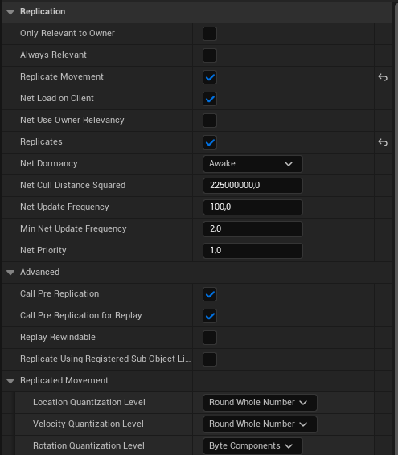

# Actor Relevancy and Priority

## Relevancy

What is 'Relevancy' and why do we need that?

Imagine having a game with Levels/Maps big enough that players could count as 'unimportant' to other players.

Why would player 'A' need to get network updates from player 'B' if they are miles apart from each other?

To improve bandwidth Unreal Engine's network code makes it possible that the server only tells clients about Actors that are in that client's relevant set.

Unreal applies the following rules (in order) to determine the relevant set of Actors for a player. These tests are implemented in the virtual function 'AActor::IsNetRelevantFor()'.

1. If the Actor is marked as 'bAlwaysRelevant', is owned by the Pawn or PlayerController, is the Pawn, or the Pawn is the Instigator of some action like noise or damage, it is relevant

2. If the Actor is marked as 'bNetUserOwnerRelevancy' and has an Owner, use the Owner's relevancy

3. If the Actor is marked as 'bOnlyRelevantToOwner', and does not pass the first check, it is not relevant

4. If the Actor is attached to the Skeleton of another Actor, then its relevancy is determined by the relevancy of its base

5. If the Actor is hidden ('bHidden == true') and the root component does not collide then the Actor is not relevant
    - If there is no root component, 'AActor::IsNetRelevantFor()' will log a warning and ask if the Actor should be set to 'bAlwaysRelevant = true'

6. If 'AGameNetworkManager' is set to use distance-based relevancy, the Actor is relevant if it is closer than the net cull distance

> INFO
>
> Pawn and PlayerController override 'AActor::IsNetRelevantFor()' and have different conditions for relevancy as a result.

## Prioritization

Unreal uses a load-balancing technique that prioritizes all Actors and gives each one a fair share of the bandwidth based on how important it is to Gameplay.

Actors have a float variable called "NetPriority". The higher this number, the more bandwidth that Actor receives relative to others.
An Actor with a "NetPriority" of 2.0 will update exactly twice as frequently as an Actor with a "NetPriority" of 1.0.

The only thing that matters with priorities is their ratio. So obviously you cannot improve Unreal's Network Performance by increasing all of the priorities.

The current priority of an Actor is calculated using the virtual function 'AActor::GetNetPriority()'.
To avoid starvation 'AActor::GetNetPriority()' multiplies 'NetPriority' with the time since the Actor was last replicated.

The 'GetNetPriority' function also considers the relative location of and distance between the Actor and the Viewer.



Most of these Settings can be found in the Class Defaults of the Blueprint and can also be set up inside the C++ Class of each Actor Child.

``` ini
bOnlyRelevantToOwner = false;
bAlwaysRelevant = false;
bReplicateMovement = true;
bNetLoadOnClient = true;
bNetUseOwnerRelevancy = false;
bReplicates = true;
NetUpdateFrequency = 100.f;
NetCullDistanceSquared = 225000000.f;
NetPriority = 1.f;
```
