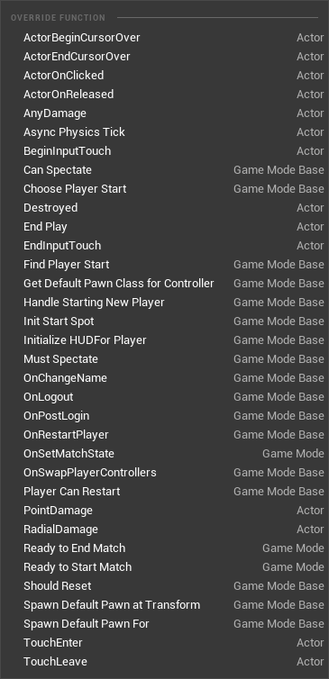
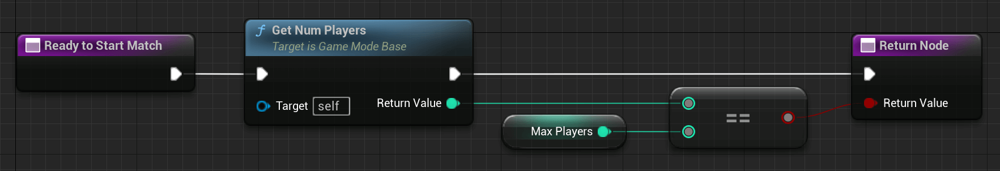
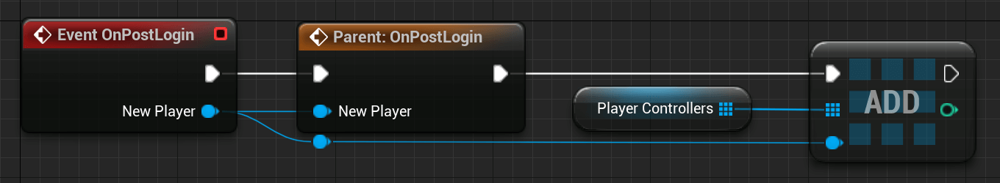
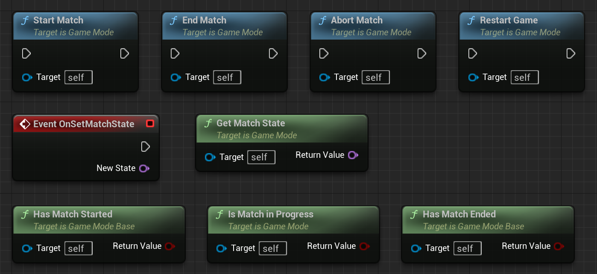
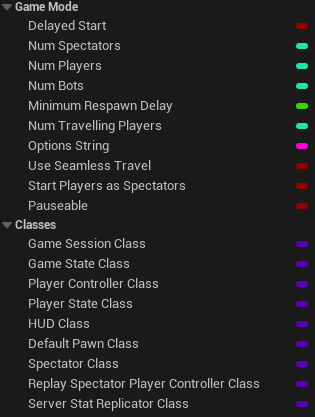
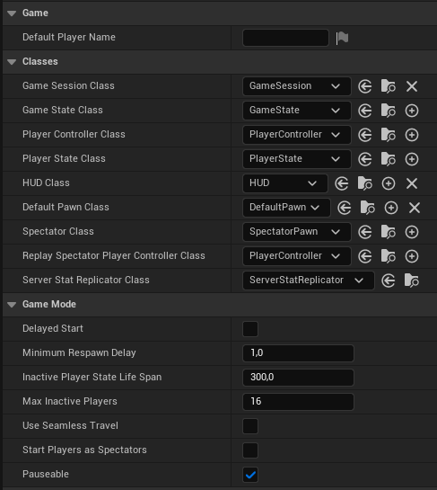
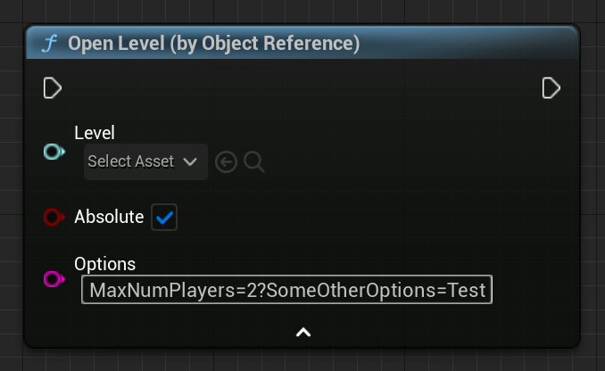
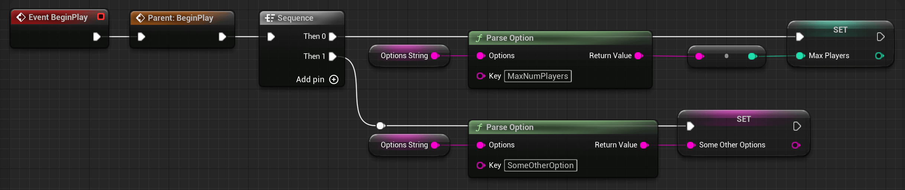

# AGameMode

> INFO
>
> With 4.14, the AGameMode Class got split into AGameModeBase and AGameMode. GameModeBase has fewer features because some games might not need the full feature list of the old AGameMode Class.

The class AGameMode is used to define the Rules of your game. This includes which other gameplay framework classes to spawn, like APawn, APlayerController, APlayerState, and more.

It is only available on the server. Clients don't have an instance of the AGameMode class and will only get a nullptr when trying to retrieve it.

## Examples & Usages

Some use cases for GameModes might be known from older First-Person shooter games, like Unreal Tournament:

Deathmatch, Team Deathmatch or Capture the Flag.

This means a GameMode can define things like:

- Do we have teams or does everyone play against everyone?
- What are the winning conditions?
  - How many kills does someone or a team need to score?
- How are the points achieved?
  - Killing someone?
  - Stealing a flag?
- What characters will be used?
- What weapons are allowed?
  - Only pistols?
  - Only one magazine?

For multiplayer scenarios, the GameMode also has some interesting functions that help us manage players and/or the general flow of the match.

## Blueprint Examples​

Functions​

The first stop we gonna take is the Override Function section of the Blueprint version:



You can implement your logic for these functions to fit specific Rules to your Game.
This includes changing the way the GameMode spawns the DefaultPawn or how you want to decide if the game is Ready to Start.

An example of this might be checking if all players have joined the server yet and are ready:



But there are also events that you can use to react to certain things, which happen throughout the match.

A good example of this, which I often use, is the 'Event OnPostLogin'.

This is called every time a new player joins the game. Later you will learn more about the connecting process, but for now, we will go along with it.

The event passes you a valid PlayerController, which is owned by the connecting player's UConnection (later more about that too).



This can be used to already interact with this player by, for example, spawning a new Pawn for them or just saving their PlayerController in an Array for later purposes.

As already mentioned, you can use the GameMode to manage the general match flow of your game. For this, you can find a few functions, some of which are overridable like 'Ready To Start Match'.

These Functions and Events can be used to control your current MatchState. Most of them will be called automatically when the 'Ready To Start Match' function returns TRUE, but you can also use them manually.



'New State' is a simple 'FName' Type. You could now ask, "Why is this not handled in the AGameState class?"

Well, it is. These GameMode functions are working hand in hand with the GameState.

This is just to give you a point to manage the MatchState unreachable by any client since the GameMode only exists on the server!

Variables​
The GameMode also has important variables you can and want to use.

This is the list of already inherited variables. Some of them can be set via the ClassDefaults of the GameMode Blueprint:





Most of them are pretty self-explaining, like 'Default Player Name', which gives you the ability to give every connecting player a default PlayerName that can be accessed via the APlayerState class.

Or 'bDelayedStart', which will keep the game from starting, even if the default implementation of 'Ready To Start Match' meets all other criteria.

One of the more important Variables is the so-called 'Options String'. These are options, separated by a '?', which you can pass via the 'OpenLevel' function or when you call 'ServerTravel' as a Console Command.

You can use 'Parse Option' to extract passed Options such as 'MaxNumPlayers':





## UE++ Examples

All of the Blueprint stuff can also be done in C++. Without writing up the same information again I will provide some code examples on how to recreate the previous Blueprint examples.

Since 'ReadyToStartMatch' is a 'BlueprintNativeEvent', the actual C++ Implementation of the function is called 'ReadyToStartMatch_Implementation'. This is the one we want to override:

### Header file of our AGameMode child class inside of the class declaration

``` cpp
// Maximum Number of Players needed/allowed during this Match
int32 MaxNumPlayers;

// Override Implementation of ReadyToStartMatch
virtual bool ReadyToStartMatch_Implementation() override;
```

### CPP file of our GameMode child class

``` cpp
bool ATestGameMode::ReadyToStartMatch_Implementation()
{
    Super::ReadyToStartMatch();

    return MaxNumPlayers == NumPlayers;
}
```

The 'OnPostLogin' function is virtual and simply called 'PostLogin' in C++.

Let's override it too:

``` cpp
// Header file of our AGameMode child class inside of the class declaration
--------------------------------------------------------------------------------
// List of PlayerControllers
UPROPERTY()
TArray<APlayerController*> PlayerControllerList;

// Overriding the PostLogin function
virtual void PostLogin(APlayerController* NewPlayer) override;
```

``` cpp
// CPP file of our GameMode child class
--------------------------------------------------------------------------------
void ATestGameMode::PostLogin(APlayerController* NewPlayer)
{
    Super::PostLogin(NewPlayer);

    PlayerControllerList.Add(NewPlayer);
}
```
