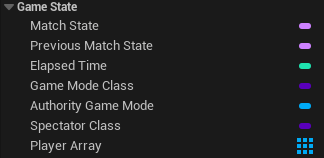

# AGameState

> INFO
>
> With 4.14, the GameState Class got split into AGameStateBase and AGameState. GameStateBase has fewer features because some games might not need the full feature list of the old GameState Class.

The class AGameState is probably the most important class for shared information between the server and the clients.

The GameState is used to keep track of the current state of the game/match. This includes, for multiplayer important, a list of connected players (APlayerState).

Additionally, it is replicated for all clients, so everyone can access it. This makes the GameState one of the most central classes for multiplayer Games in terms of information.

While the GameMode would tell how many kills are needed to win, the GameState would keep track of the current amount of kills of each player and/or team!

What information you store here is completely up to you. It could be an array of scores or an array of a custom struct that you use to keep track of groups and guilds.

## Examples and Usage

In multiplayer, the AGameState class is used to keep track of the current state of the game, which also includes the players and their PlayerStates.

The GameMode makes sure that the MatchState functions of the GameState are called and the GameState itself allows you to use them on clients as well.

Compared to the GameMode the GameState doesn't give us much to work with, but this still allows us to create our logic, which should mostly try to spread information to clients.

### Blueprint Examples

#### Variables



We get a few variables from the base AGameState Class that we can utilize. The PlayerArray, as well as the MatchState and the ElapsedTime are replicated, so clients can also access them.

This does not count for the AuthorityGameMode. Only the server can access it since the GameMode only exists on the server.

The PlayerArray is not directly replicated, however, every PlayerState is replicated and they add themselves to the PlayerArray on construction. Additionally, they are collected by the GameState, just to ensure no race-condition causes problems.

A quick insert to show how the PlayerStates are collected into the PlayerArray in C++.

``` cpp
// Inside of the PlayerState Class itself
--------------------------------------------------------------------------------
void APlayerState::PostInitializeComponents()
{
    // […]

    UWorld* World = GetWorld();
    // Register this PlayerState with the Game's ReplicationInfo
    if (World->GameState != NULL) {
        World->GameState->AddPlayerState(this);
    }

    // […]
}
```

``` cpp
// And in the GameState
--------------------------------------------------------------------------------
void AGameState::PostInitializeComponents()
{
    // […]

    for (TActorIterator<APlayerState> It(World); It; ++It) {
        AddPlayerState(*It);
    }
}

void AGameState::AddPlayerState(APlayerState* PlayerState)
{
    if (!PlayerState->bIsInactive) {
        PlayerArray.AddUnique(PlayerState);
    }
}
```

All of this happens on the server and the client instances of Player- and GameState!

#### Functions​

A small function example I could provide you with would be keeping track of the score of two teams 'A' and 'B'. Let's say we have a CustomEvent which is called when a team scores.

It passes a boolean so we know which team scored. We could also pass in a PlayerState, Team, or whatever you utilize to identify who scored.

Later in the "Replication" chapter, you will read about the rule that only the server can (and should) replicate variables, so we make sure only he can call this event.

The event is called from another class (for example a weapon that killed someone) and this should happen on the Server (always!), so we don't need an RPC here.


Since these variables and the GameState are replicated you can use these two variables and get them in any other class you need them. For example, to display them in a scoreboard widget.

#### UE++ Examples​

To recreate this small example we need a bit more code, but despite the function itself the code needed to set up the replication is only needed once per class.

``` cpp
// Header file of our AGameState class inside of the class declaration
--------------------------------------------------------------------------------
// You need this included to get the replication working.
#include "UnrealNetwork.h"

// Replicated specifier used to mark this variable to replicate
UPROPERTY(Replicated)
int32 TeamAScore;

UPROPERTY(Replicated)
int32 TeamBScore;

// Function to increase the score of a team
void AddScore(bool bTeamAScored);
```

You will read more about this function in the Replication part!

``` cpp
// CPP file of our AGameState child class
--------------------------------------------------------------------------------
// This function is required through the replicated specifier in the UPROPERTY macro and is declared by it
void ATestGameState::GetLifetimeReplicatedProps(TArray<FLifetimeProperty>& OutLifetimeProps) const
{
    Super::GetLifetimeReplicatedProps(OutLifetimeProps);

    DOREPLIFETIME(ATestGameState, TeamAScore);
    DOREPLIFETIME(ATestGameState, TeamBScore);
}
```

``` cpp
// CPP file of our AGameState child class
--------------------------------------------------------------------------------
void ATestGameState::AddScore(bool bTeamAScored)
{
    if (bTeamAScored) {
        TeamAScore++;
    } else {
        TeamBScore++;
    }
}
```
