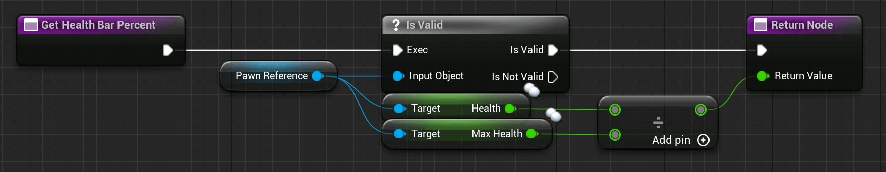

# APawn and ACharacter

The class APawn is the 'AActor' which the player controls. Most of the time it's a humanoid character, but it could also be a cat, plane, ship, block, etc.
The player can only possess one Pawn at a time, but can easily switch between Pawns by unpossessing and re-possessing them.

The Pawn is mostly replicated to all clients.

The Pawn's child class ACharacter is often used because it comes with an already networked MovementComponent which handles replicating the position, rotation, etc. of a player's character.

## Examples and Usage

In Multiplayer we mostly use the Replication Part of the Pawn to display the Character and share some information with others. A simple example is the 'Health' of a Character.
But we don't only replicate 'Health' to make it visible for others, we also replicate it so that the Server has authority over it and the Client can't cheat.

### Blueprint​

Despite the standard overridable functions, the Pawn also has two which let you react to it being un-/possessed by a Player- or AIController.


> INFO
>
> Since the possessing logic happens on the server these events are only called on the server Version if the Pawn/Character.
>
> There is also a function called ReceiveControllerChanged, which allows you to react to the same events, but on the client Side.

The following picture will show how you could use the EventAnyDamage function and a replicated Health variable to lower the player's health.

This happens on the server and not on the client!


Since the Pawn should be replicated the DestroyActor node will also destroy the client versions of the Pawn, as long as the server calls it.
On the client site, we can use the replicated 'Health' variable for our HUD or a Health Bar on top of everyone's head.

You can easily do this by creating a UserWidget with a ProgressBar and a reference to the Pawn.

Since this is a Multiplayer Compendium I expect you to know about UserWidgets, or at least to read up about them somewhere else.

Let's assume we have a 'Health' and 'MaxHealth' variable on our 'BP_Character' class, all set to replicate (you could skip replicating MaxHealth if it never changes runtime).

Now after creating the 'BP_Character' reference variable inside of the UserWidget, as well as the ProgressBar, we can bind the percentage of that bar to the following function:




Further, after setting up the WidgetComponent we can set the 'Widget Class To Use' to your HealthBar UserWidget and on BeginPlay, do the following:


'BeginPlay' is called on all instances of the Pawn, which means on the server and all clients.

So every instance now sets itself to the Pawn reference of the UserWidget it has.

And since the Pawn and the Health Variable are replicated we have the correct percentage above every Pawn's head.


If the replication process is not clear at this point, don't worry, just keep reading and at the end of this, you will understand why this works so easily!

### UE++​

For the C++ examples, I won't recreate the UserWidget example. It's just too much boilerplate stuff that needs to be done to get UserWidgets working in C++ and I don't want to cover this here.

So we will focus on the Possess and Damage Events. In C++, the two Possess events are called:

``` cpp
virtual void PossessedBy(AController* NewController);

virtual void UnPossessed();
```

The 'UnPossessed' event does not pass the old PlayerController though.

And we also want to recreate the Health example in C++. As always, if you don't understand the steps of replication at this moment, don't worry, the upcoming chapters will explain it to you.

Simply skip the examples for now if they seem too complicated in terms of replication.

The 'TakeDamage' function is the equivalent of the 'EventAnyDamage' node. To cause damage you normally call 'TakeDamage' on the Actor you want to deal damage to and if that Actor implements the function, it will react to it, similar to how this example does it.

``` cpp
// Header file of our APawn child class, inside of the class declaration
--------------------------------------------------------------------------------
// Replicated Health variable
UPROPERTY(Replicated)
int32 Health;

// Overriding the TakeDamage event
virtual float TakeDamage(float Damage, struct FDamageEvent const& DamageEvent, AController* EventInstigator, AActor* DamageCauser) override;
```

``` cpp
// CPP
--------------------------------------------------------------------------------
// This function is required and the replicated specifier in the UPROPERTY macro causes it to be declared for us. We only need to implement it
void ATestPawn::GetLifetimeReplicatedProps(TArray<FLifetimeProperty>& OutLifetimeProps) const
{
    Super::GetLifetimeReplicatedProps(OutLifetimeProps);

    // This tells UE that we want to replicate this variable
    DOREPLIFETIME(ATestPawn, Health);
}

float ATestPawn::TakeDamage(float Damage, struct FDamageEvent const& DamageEvent, AController*EventInstigator, AActor* DamageCauser)
{
    const float ActualDamage = Super::TakeDamage(Damage, DamageEvent, EventInstigator, DamageCauser);

    // Lower the Health of the Player
    Health -= ActualDamage;

    // And destroy it if the Health is less or equal 0
    if (Health <= 0.f)
    {
        Destroy();
    }

    return ActualDamage;
}
```
