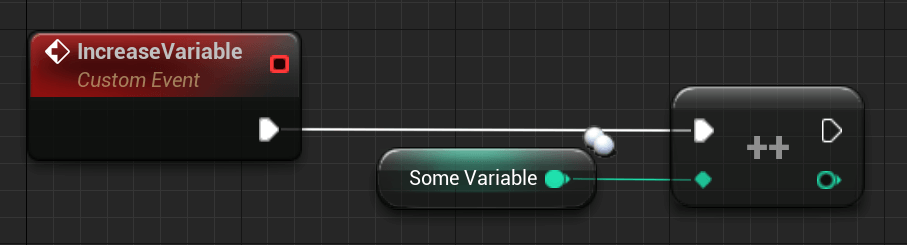
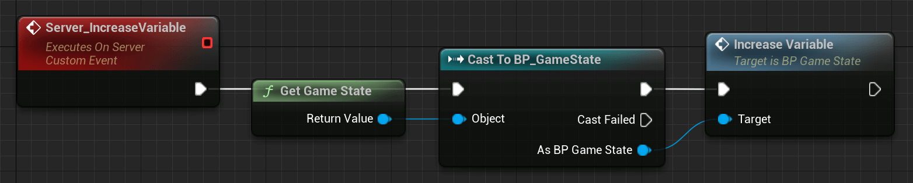
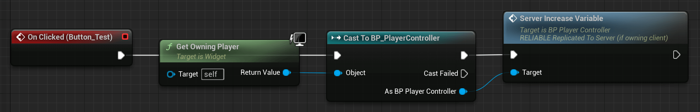

# APlayerController

The class APlayerController might be the most interesting and complicated class that we come across. It's also the center for a lot of client logic since this is the first class that the client actually 'owns'.

The PlayerController can be seen as the 'Input' of the player. It is the link of the player with the server. This further means every client has one PlayerController.
A client's PlayerController only ever exists on their end, as well as on the server. A client cannot access other clients' PlayerControllers.

Every client only knows about their own PlayerController!

The result of that is that the server has a reference of all client PlayerControllers!

The term 'Input' does not directly mean that all actual Input (Button Presses, Mouse Movement, Controller Axis, etc.) needs to be placed in the PlayerController.

It is a good practice to place Pawn/Character specific Input (cars work differently than humans) into your APawn/ACharacter classes and to place Input that should work with all Characters, or even when the Character object is not valid, into your PlayerController.

Furthermore, an important thing to know is:

How do I get the correct PlayerController?

The famous node 'GetPlayerController(0)' or code line 'UGameplayStatics::GetPlayerController(GetWorld(), 0);' works differently on the server and clients.

- Calling it on the Listen-Server will return the Listen-Server's PlayerController
- Calling it on a Client will return the Client's PlayerController
- Calling it on a Dedicated Server will return the first Client's PlayerController

Other numbers than '0' will not return other clients' PlayerControllers for a client. This index is meant to be used for local players (splitscreen), which we won't cover here.

## Examples and Usage​

Even though the APlayerController is one of the most important classes for networking, there isn't much to it by default.

So we will create a small example just to make clear why it's needed. In the chapter about ownership, you will read about why the PlayerController is important for RPCs.

The following example will show you how to utilize the PlayerController to increment a replicated variable in the GameState by pressing a UserWidget button.

Why do we need the PlayerController for this?

Well, I don't want to write down the RPC and Ownership chapter twice, so just a short explanation:

UserWidgets only exist on the local player (being a client or a ListenServer) and even if they are owned by the client a ServerRPC has no instance of them on the server to run on.

It's simply not replicated!

This means we need a way to get the button Press over to the server so it can then increment the variable.

Why not call the RPC on the GameState directly?

Because it's owned by the server. A ServerRPC needs the client as the owner!

### Blueprint​

So first of all, we need a simple UserWidget with a button that we can press.

I will post the images in the opposite order, so you can see where it ends and what events call the events of the previous images.

So starting with our goal, the GameState. It gets a normal event that increments a replicated integer variable:



This event will get called on the server side, inside of our ServerRPC in our PlayerController:



And at last, we have our button, which gets pressed and calls the ServerRPC:



So when we click on the button (client side), we use the ServerRPC in our PlayerController to get to the server side (possible, because the PlayerController is owned by the client!) and then call the 'IncreaseVariable' event of the GameState to increment the replicated integer variable.

This integer variable, since it is replicated and set by the server, will now update on all instances of the GameState so that clients can also see the update!

### UE++​

For the C++ version of this example, I will replace the UserWidget with the BeginPlay of the PlayerController. This doesn't make much sense, however, implementing UserWidgets in C++ needs some more code which I don't want to post here.

``` cpp
// Header file of our APlayerController child class, inside of the class declaration
--------------------------------------------------------------------------------
// Server RPC. You will read more about this in the RPC chapter
UFUNCTION(Server, unreliable, WithValidation)
void Server_IncreaseVariable();

// Also overriding the BeginPlay function for this example
virtual void BeginPlay() override;
```

``` cpp
// Header file of our AGameState child class, inside of the class declaration
--------------------------------------------------------------------------------
// Replicated integer variable
UPROPERTY(Replicated)
int32 OurVariable;

public:
// Function to increment the variable
void IncreaseVariable();
```

``` cpp
// CPP file of our PlayerController child class
--------------------------------------------------------------------------------
// Otherwise we can't access the GameState functions
#include "TestGameState.h"

// You will read later about RPCs and why '_Validate' is a thing
bool ATestPlayerController::Server_IncreaseVariable_Validate() {
    return true;
}

// You will read later about RPCs and why '_Implementation' is a thing
void ATestPlayerController::Server_IncreaseVariable_Implementation() {
    ATestGameState* GameState = Cast<ATestGameState>(UGameplayStatics::GetGameState(GetWorld()));
    GameState->IncreaseVariable();
}

void ATestPlayerController::BeginPlay() {
    Super::BeginPlay();

    // BeginPlay is called on every instance of an Actor, so also on the server version of this PlayerController.
    // We want to ensure, that only the local player calls this RPC. Again, this example doesn't necessarily make much sense
    // since we could just flip the condition and wouldn't need the RPC at all, but C++ Widget, you know...
    // We could also use "IsLocalPlayerController()" here
    if (Role < ROLE_Authority) {
        Server_IncreaseVariable();
    }
}
```

``` cpp
// CPP file of our AGameState child class
--------------------------------------------------------------------------------
// This function is required and the replicated specifier in the UPROPERTY macro causes it to be declared for us. We only need to implement it
void ATestGameState::GetLifetimeReplicatedProps(TArray<FLifetimeProperty>& OutLifetimeProps) const {
    Super::GetLifetimeReplicatedProps(OutLifetimeProps);

    // This tells UE that we want to replicate this variable
    DOREPLIFETIME(ATestGameState, OurVariable);
}

void ATestGameState::IncreaseVariable() {
    OurVariable++;
}
```

That's quite some code. If you don't understand the use of some of the functions and their naming yet, don't worry. The upcoming sections will help you understand why it's done like this.
