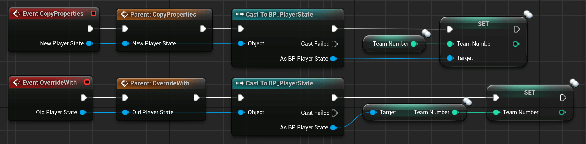

# APlayerState

The class APlayerState is the most important class for shared information about a specific player. It is meant to hold current information about the player. Each player has their PlayerState.

The PlayerState is also replicated to everyone and can be used to retrieve and display data on other clients. An easy way to access all PlayerStates is the PlayerArray inside of the AGameState class.

Example information that you might want to store in a PlayerState:

- PlayerName - Current name of the player
- Score - Current score of the player
- Ping - Current ping of the player
- TeamID - The ID of the player's team
- Or other replicated information that other players might need to know about

## Examples and Usage

Most of the examples I could provide would be very specific. So instead we are going to have a look at some of the already available properties, as well as some of the more interesting functions.

### Blueprint Examples

There are a few variables exposed to Blueprints, which can be more or less useful. Sadly some of them aren't exposed with all their functionality, so it might be best to replace them with your own.


These variables are all replicated, so they are kept in sync on all clients.

Sadly they are not easily settable in Blueprints, but nothing keeps you from creating your versions of them.

An example of how the PlayerName variable can be set is by calling "ChangeName", a GameMode function, and passing it the PlayerController of the Player.


The PlayerState is also used to make sure that data stays persistent during Seamless level changes or unexpected connection issues.

The PlayerState has two functions dedicated to dealing with reconnecting players and also players that seamlessly traveled with the server to a new map.

While not originally, by now these functions are also available to Blueprints.

The PlayerState takes care of copying over the information, which it already holds, into a new PlayerState. This either gets created through the level change or because a player is reconnecting.



### UE++ Examples​

Let's have a look at the same functions but in C++.

``` cpp
// Header file of our APlayerState child class inside of the class declaration
--------------------------------------------------------------------------------
// Used to copy properties from the current PlayerState to the passed one
virtual void CopyProperties(class APlayerState* PlayerState);

// Used to override the current PlayerState with the properties of the passed one
virtual void OverrideWith(class APlayerState* PlayerState);
```

These functions can be implemented into your own C++ PlayerState child class to manage data that you added to your custom PlayerState.

Make sure to add the "override" specifier at the end, as well as to call "Super::" so that the original implementation stays active.

Your implementation could look similar to this one:

``` cpp
// CPP file of our APlayerState child class
--------------------------------------------------------------------------------
void ATestPlayerState::CopyProperties(class APlayerState* PlayerState)
{
    Super::CopyProperties(PlayerState);

    if (IsValid(PlayerState)) {
        ATestPlayerState* TestPlayerState = Cast<ATestPlayerState>(PlayerState);
        if (IsValid(TestPlayerState)) {
            TestPlayerState->SomeVariable = SomeVariable;
        }
    }
}

void ATestPlayerState::OverrideWith(class APlayerState* PlayerState)
{
    Super::OverrideWith(PlayerState);

    if (IsValid(PlayerState)) {
        ATestPlayerState* TestPlayerState = Cast<ATestPlayerState>(PlayerState);
        if (IsValid(TestPlayerState)) {
            SomeVariable = TestPlayerState->SomeVariable;
        }
    }
}
```
