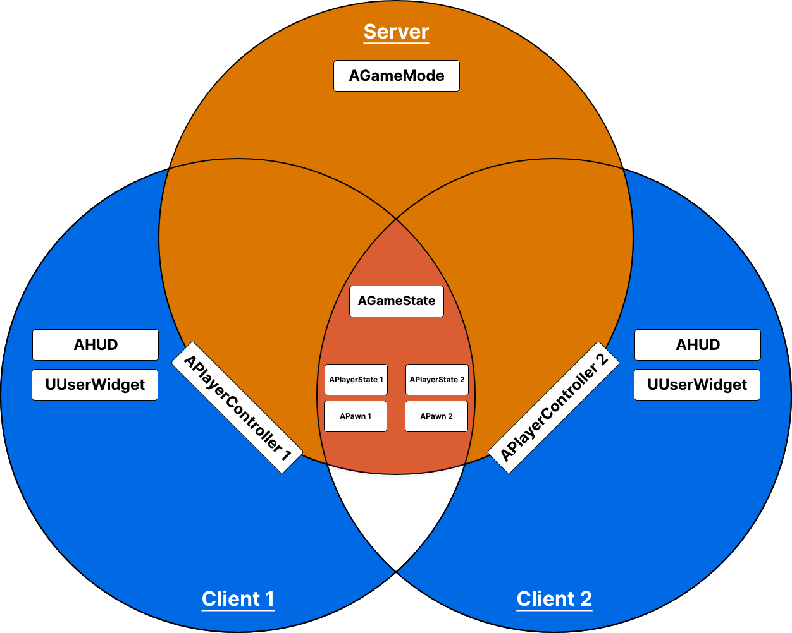

# Gameplay Framework + Network

With the previous information about Unreal Engine's Server-Client architecture and the common classes we can divide those into four categories:

- Server Only - These objects only exist on the server
- Server & Clients - These objects exist on the server and all clients
- Server & Owning Client - These objects only exist on the server and the owning client
- Owning Client Only - These objects only exist on the owning client

"Owning Client" is the player/client who owns the actor in question. You can see this the same way as you own your computer. Ownership becomes important for "RPCs" in a later chapter.

The following two graphics show you some of the common classes and in which of the categories they exist.

The second graphic demonstrates an example of a dedicated server with two connected clients.

