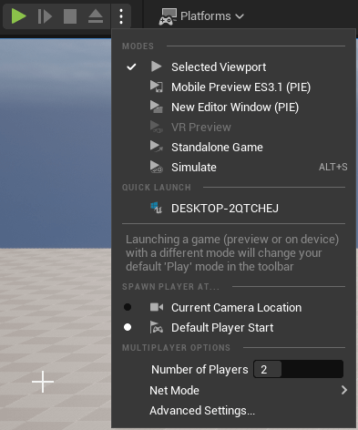
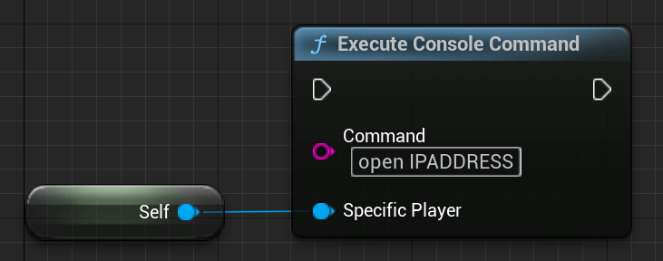

# How to Start a Multiplayer Game

The easiest way to start a Multiplayer Game is to set the Number of Players, in the Play Drop-Down Menu, to something higher than 1.



This will automatically create a network connection between the server and the clients. So even if you start the game in your Main Menu Level with "Number of Players" set to 2+, the games will be connected!

This is always a network connection. It's NOT a local couch-coop Multiplayer connection. This needs to be handled differently and will not be covered at this point.

## Advanced Settings​


### Run Under One Process​

When Use Single Process is checked, multiple windows are spawned in a single instance of Unreal Engine.

When this option is unchecked, multiple instances of UE will be launched for each player that is assigned.

Without checking "Run Dedicated Server" the first player will be a ListenServer.

On the other hand, when marking it as TRUE, all Players will be clients.

### Start and Connect to a Server​

Check the "Session Management" Tab to learn how to set up a Session/Server via the Session System. Let's have a look at how you can start and join a server without sessions.

#### Blueprint​

##### Start a (Listen) Server​


To start the Server, without the Session System, you simply use the 'OpenLevel' Node and pass it the 'Level Name' and the 'listen' Option.
You can also pass more Options, separated by a '?', which can be retrieved in the AGameMode Class as explained.

A Dedicated Server, without Session System, already starts on the correct map, which you can specify in the 'Maps & Modes' section of your Project Settings.

##### Connect to a Server​



To connect to a server you simply use the 'Execute Console Command' Node with the command 'open IPADDRESS', where 'IPADDRESS' is replaced by the actual IP-address of the server.

This can be filled in through a Widget Text-Box, for example.

#### UE++​

Similar to Blueprints, you can use these two functions, which have the same result as the Blueprint Nodes.

##### Start a (Listen) Server​

``` cpp
UGameplayStatics::OpenLevel(GetWorld(), "LevelName", true, "listen");
```

##### Connect to a Server​

``` cpp
// Assuming you are not already in the PlayerController (if you are, just call ClientTravel directly)
APlayerController* PlayerController = UGameplayStatics::GetPlayerController(GetWorld(), 0);
PlayerController->ClientTravel("IPADDRESS", ETravelType::TRAVEL_Absolute);
```

### Starting via Command Line

Basic command lines (these commands use the editor and therefore don't require cooked data):

| Type | Command |
| ---- | ------- |
| Listen Server    | UE4Editor.exe ProjectName MapName?Listen -game |
| Dedicated Server | UE4Editor.exe ProjectName MapName -server -game -log |
| Client           | UE4Editor.exe ProjectName ServerIP -game |

> INFO
>
> Dedicated Servers are headless by default. If you don't use "-log", you won't see any window to present the Dedicated Server!

### Connection Process

When a new client connects for the first time, a few things happen:

First, the client will send a request to the server to connect.

The server will process this request, and if the server doesn't deny the connection, will send a response back to the client, with proper information to proceed.

The following page will show the major steps of the connection process. This is a direct extract from the official Documentation.

The major steps are​

1. Client sends a connect request.

2. If the Server accepts, it will send the current map

3. The Server will wait for the Client to load this map

4. Once loaded, the Server will then locally call "AgameMode::PreLogin"
    - This will give the GameMode a chance to reject the connection

5. If accepted, the Server will then call "AgameMode::Login"

    - The role of this function is to create a PlayerController, which will then be replicated to the newly connected Client.

        Once received, this PlayerController will replace the clients temporary PlayerController that was used as a placeholder during the connection process Note that "APlayerController::BeginPlay" will be called here.

        It should be noted that it is NOT yet safe to call RPC functions on this actor. You should wait until "AGameMode::PostLogin" is called.

6. Assuming everything went well, "AGameMode::PostLogin" is called.
    - At this point, it is safe for the Server to start calling RPC functions on this PlayerController.
