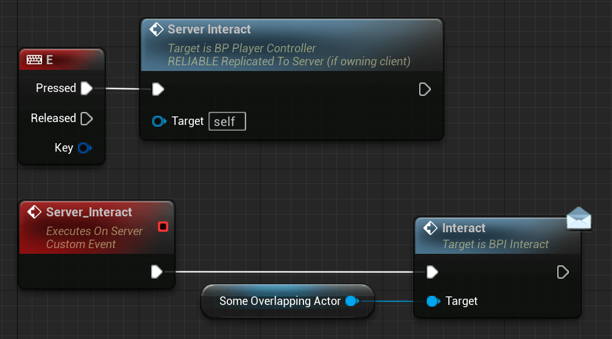

# Ownership

Ownership is something very important to understand. You already saw a table that contained entries like "Client-owned Actor".

Server or Clients can 'own' an Actor.

An example is the PlayerController which is owned by the local player (client or Listen-Server).

Another example would be a spawned/placed door in the Scene. This will mostly be owned by the server.

But why is this a problem?

If you check out the table from earlier again you will notice that, for example, a Server RPC will be dropped if a client calls it on an Actor that they do not own.

So the client can't call "Server_Interact" on a server owned door. But how do we work around that?

We use a class/Actor that the client owns and this is where the PlayerController starts to shine. We already had a similar example when discussing the PlayerController class, where we send an RPC to increment a value based on a UserWidget button press.

So instead of trying to enable Input on the door and calling a ServerRPC there, we create the ServerRPC in the PlayerController and let the server call an interface function on the door (for example 'Interact').

> INFO
>
> Interfaces are nothing Multiplayer specific and I highly recommend looking them up if you don't know about them yet.

## Actors and their Owning Connections​

As already mentioned in the Gameplay Framework overview, the PlayerController is the first class that the player 'owns', but what does that mean?

Each 'Connection' has a PlayerController, created specifically for that Connection. A PlayerController, which is created for that reason is owned by that Connection.

So when we want to determine if an Actor is owned by someone, we query up-wards (recursively) until reaching the most outer owner and if this is a PlayerController, then the Connection that owns the PlayerController also owns that Actor.

Kinda simple, or? So what would be an example of that?

The Pawn/Character. They are possessed by the PlayerController and during that time, the PlayerController is the owner of the possessed Pawn. This means the Connection that owns this PlayerController also owns the Pawn.

This is only the case WHILE the PlayerController is possessing the Pawn. Un-possessing it will result in the client no longer owning the Pawn.

So why is this important and for what do I need this?

- RPCs need to determine which client will execute a Run-On-Client RPC
- Actor replication and connection relevancy
- Actor property replication conditions when the owner is involved

You already read that RPCs react differently when getting called by clients or the server depending on the Connection they are owned by.

You also read about conditional Replication, where variables are only replicated under a certain condition.

The following section describes the relevancy part of the list.
