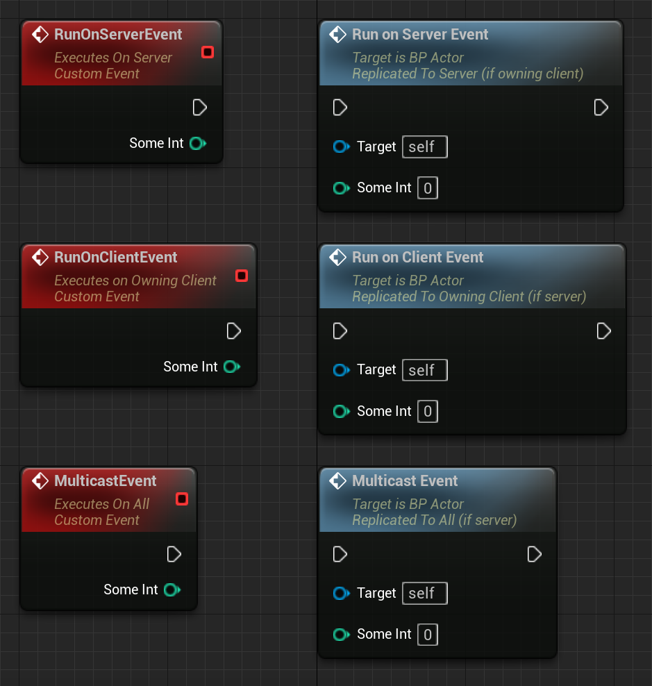
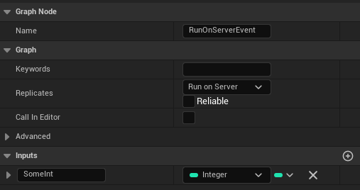

# Remote Procedure Calls

Other ways for Replication are so-called "RPC"s. Short form for "Remote Procedure Call".

They are used to call something on another instance. Your TV-remote does the same with your television.

Unreal Engine uses them to send events from client to server, server to client or server to a specific group.

These RPCs can't have a return value! To return something you need to use a second RPC in the other direction.

RPCs only work under certain rules. They are listed in this table which can also be found in the official Documentation:

- Run on Server - Is meant to be executed on the server instance of this Actor
- Run on owning Client - Is meant to be executed on the owner of this Actor
- NetMulticast - Is meant to be executed on all instances of this Actor

## Requirements and Caveats​

There are a few requirements that need to be met for RPCs to be completely functional:

1. They must be called on Actors or a replicated Subobject (e.g. a component)

2. The Actor (and component) must be replicated

3. If the RPC is being called by the server to be executed on a client, only the client who owns that Actor will execute the function

4. If the RPC is being called by a client to be executed on the server, the client must own the Actor that the RPC is being called on

5. Multicast RPCs are an exception:

    - If they are called by the server, the server will execute them locally, as well as execute them on all currently connected clients, which have an instance of that Actor that is relevant

    - If they are called from clients, a Multicast will only execute locally, and will not execute on the server or other clients

    - For now, we have a simple throttling mechanism for Multicast events:

        - A Multicast function will not replicate more than twice in a given Actor's network update period.
Long term, Epic expects to improve on this.

### RPC invoked from the Server

| Actor Ownership | Not Replicated | NetMulticast | Server | Client |
| --------------- | -------------- | ------------ | ------ | ------ |
| Client-owned Actor | Runs on Server | Runs on Server and all Clients | Runs on Server | Runs on Actor's owning Client |
| Server-owned Actor | Runs on Server | Runs on Server and all Clients | Runs on Server | Runs on Server |
| Unonwed Actor      | Runs on Server | Runs on Server and all Clients | Runs on Server | Runs on Server |

### RPC invoked from a Client

| Actor Ownership | Not Replicated | NetMulticast | Server | Client |
| --------------- | -------------- | ------------ | ------ | ------ |
| Owned by invoking Client | Runs on invoking Client | Runs on invoking Client | Runs on Server | Runs on invoking Client |
| Owned by a different Client | Runs on invoking Client | Runs on invoking Client | Dropped | Runs on invoking Client |
| Server-owned Actor | Runs on invoking Client | Runs on invoking Client | Dropped | Runs on Invoking Client |
| Unowned Actor | Runs on invoking Client | Runs on invoking Client | Dropped | Runs on Invoking Client |

## RPCs in Blueprints​



RPCs in Blueprints are created by creating CustomEvents and setting them to Replicate.



RPCs can't have a return value, so functions can't be used to create them.

The 'Reliable' check box can be used to mark the RPC as 'important', trying to ensure that the RPC is not dropped.

> ATTENTION
>
> Don't mark every RPC as Reliable! You should only do this on RPCs which are called once in a while and you require them to reach their destination.
>
> Calling reliable RPCs on Tick can have side effects, such as filling the reliable buffer, which can cause other properties and RPCs to not be processed anymore.

## RPCs in UE++

To use the whole Network stuff in C++, you need to include "UnrealNetwork.h" in your project Header. RPCs in C++ are relatively easy to create, we only need to add the specifier to the UFUNCTION() macro.

``` cpp
// This is a ServerRPC, marked as unreliable and WithValidation (is required!)
UFUNCTION(Server, unreliable, WithValidation)
void Server_Interact();
```

The CPP file will implement a different function. This one needs '_Implementation' as a suffix.

``` cpp
// This is the actual implementation, not Server_Interact. But when calling it we use "Server_Interact"
void ATestPlayerCharacter::Server_Interact_Implementation() {
    // Interact with a door or so!
}
```

The CPP file also needs a version with '_Validate' as a suffix. Later more about that.

``` cpp
bool ATestPlayerCharacter::Server_Interact_Validate() {
    return true;
}
```

The other two types of RPCs are created like this:

ClientRPC, which needs to be marked as 'reliable' or 'unreliable'.

``` cpp
UFUNCTION(Client, unreliable)
void ClientRPCFunction();
```

and Multicast RPC, which also needs to be marked as 'reliable' or 'unreliable'.

``` cpp
UFUNCTION(NetMulticast, unreliable)
void MulticastRPCFunction();
```

Of course, we can also add the 'reliable' keyword to an RPC to make it reliable

``` cpp
UFUNCTION(Client, reliable)
void ReliableClientRPCFunction();

UFUNCTION(NetMulticast, reliable)
void ReliableMulticastRPCFunction();
```

## Validation (UE++)​

The idea of validation is that if the validation function for an RPC detects that any of the parameters are bad, it can notify the system to disconnect the client/server who initiated the RPC call.

Validation is required for now for every ServerRPCFunction. The 'WithValidation' keyword in the UFUNCTION Macro is used for that.

``` cpp
UFUNCTION(Server, unreliable, WithValidation)
void SomeRPCFunction(int32 AddHealth);
```

Here is an example of how the '_Validate' function can be used:

``` cpp
bool ATestPlayerCharacter::SomeRPCFunction_Validate(int32 AddHealth) {
    if (AddHealth > MAX_ADD_HEALTH) {
        return false; // This will disconnect the caller!
    }
    return true; // This will allow the RPC to be called!
}
```

> INFO
>
> Client-to-Server RPCs require the '_Validate' function to encourage secure Server RPC functions and to make it as easy as possible for someone to add code to check every parameter to be valid against all the known input constraints.
