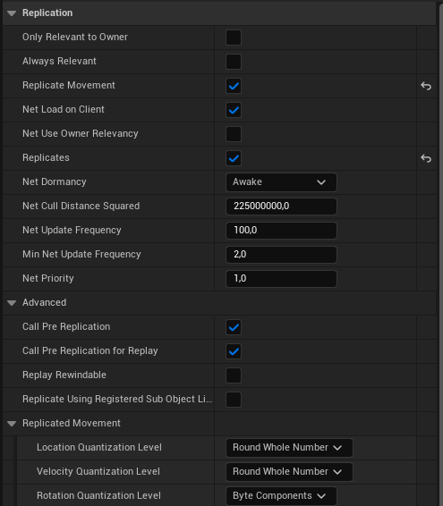
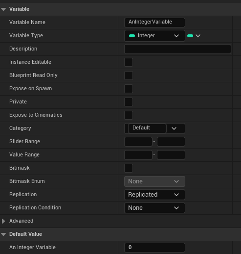
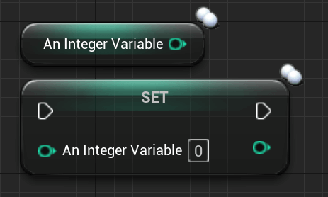
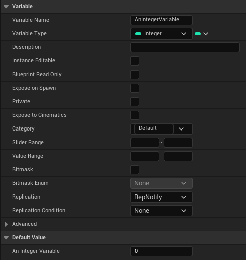
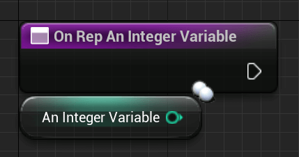

# Replication

## What is 'Replication'?​

Replication is the act of the server passing information/data to the clients.

This can be limited to specific entities and groups. Blueprints mostly perform replication according to the settings of the affected AActor.

The first class, which is capable of replicating properties, is the AActor class. While you can also replicate UObjects, they are replicated via an AActor, still requiring you to have some sort of AActor to handle the replication.

A good example of UObjects that support being replicated via an AActor without much additional work required by us is a UActorComponent.

All of the before mentioned classes inherit from AActor at some point, giving them the ability to replicate properties if needed. Though not all of them do this the same way.

The AGameMode, for example, doesn't replicate at all and only exists on the server. And AHUD only exists on clients, also not replicating.

## How to use 'Replication'?



Replication can be activated in the Class Defaults/Constructor of an AActor child class:

``` cpp
// Example for an Character Constructor
--------------------------------------------------------------------------------
ATestCharacter::ATestCharacter(const FObjectInitializer& ObjectInitializer) : Super(ObjectInitializer) {
    bReplicates = true;
    bReplicateMovement = true;
}
```

An Actor with 'bReplicates' set to TRUE will be spawned and replicated on all clients if spawned by the server. And ONLY when spawned by the server.

If a client spawns this Actor the Actor will ONLY exist on this very client.

## Replicating properties​



When replication is enabled we can replicate variables inside of the Actor. There are multiple ways to do this. We will start with the most basic one:

Setting the "Replication" Drop-Down menu to "Replicated" will ensure this variable gets replicated to all replicated Instances of this Actor.

Variables can be replicated under certain conditions. We will talk about those a bit further along.

Replicated variables are marked with two white circles.



Replicating a variable in C++ requires slightly more work.

``` cpp
// Header file inside of the classes declaration
--------------------------------------------------------------------------------
// Create replicated health variable
UPROPERTY(Replicated)
float Health;
```

The .cpp file will get this 'GetLifetimeReplicatedProps' function. The header declaration of that function is already created for us by UE when marking a variable as replicated.

In this function, you may define the rules of replicating your variables.

``` cpp
void ATestPlayerCharacter::GetLifetimeReplicatedProps(TArray<FLifetimeProperty>& OutLifetimeProps) const {
    Super::GetLifetimeReplicatedProps(OutLifetimeProps);

    // Here we list the variables we want to replicate
    DOREPLIFETIME(ATestPlayerCharacter, Health);
}
```

You can also do a conditional replication here:

``` cpp
// Replicates the Variable only to the Owner of this Object/Class
DOREPLIFETIME_CONDITION(ATestPlayerCharacter, Health, COND_OwnerOnly);
```

| Condition | Description |
| --------- | ----------- |
|COND_InitialOnly        | This property will only attempt to send on the initial bunch |
|COND_OwnerOnly          | This property will only send to the Actor's owner |
|COND_SkipOwner          | This property send to every connection EXCEPT the owner |
|COND_SimulatedOnly      | This property will only send to simulated Actors |
|COND_AutonomousOnly     | This property will only send to autonomous Actors |
|COND_SimulatedOrPhysics | This property will send to simulated OR bRepPhysics Acto |
|COND_InitialOrOwner     | This property will send on the initial bunch, or to the Actor's owner |
|COND_Custom             | This property has no particular condition, but wants the ability to toggle on/off via SetCustomIsActiveOverride |

It's important to understand that the whole replication process only works from Server to client and NOT the other wayround.

We will learn later how to get the server to replicate something that the client wants to share with others (for example their PlayerName).

A different way to replicate a variable is to mark it as "ReplicatedUsing". In Blueprints this is called "RepNotify". It allows specifying a function that gets called on the client when the new value of the variable is replicated to them.



In Blueprints this function will be created automatically once you select "RepNotify" in the "Replication" Drop-Down menu:



The C++ version needs a bit more but works the same:

``` cpp
// Header file inside of the classes declaration
--------------------------------------------------------------------------------
// Create RepNotify Health variable
UPROPERTY(ReplicatedUsing=OnRep_Health)
float Health;

// Create OnRep function | UFUNCTION() Macro is important! | Doesn't need to be virtual
UFUNCTION()
virtual void OnRep_Health();
```

``` cpp
// CPP file of the class
--------------------------------------------------------------------------------
void ATestCharacter::OnRep_Health() {
    if (Health <= 0.f) {
        PlayDeathAnimation();
    }
}
```

With 'ReplicatedUsing=FUNCTIONNAME', we specify the function that should get called when the variable is successfully replicated. This function needs to have the 'UNFUNCTION()' macro, even if the macro is empty!

> REP NOTIFY DEFFIRENCE BETWEEN C++ AND BLUEPRINTS
>
> It's important to note here that C++ and Blueprints handle RepNotify slightly differently. In C++, RepNotify functions only call > for the clients.
>
> When a server changes the value and requires the OnRep function to call too, you will need to call it manually after adjusting > the variable. That's because the OnRep function is meant as a callback for when the variable is replicated to the client.
>
> In Blueprints, however, the OnRep function will call for clients and server. That's because the BP version of OnRep is a "Property Changed" callback. This means that the function will call for the server too, but also for the client if the client changes the variable locally.
