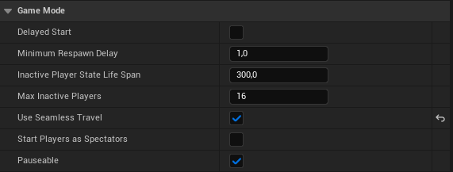
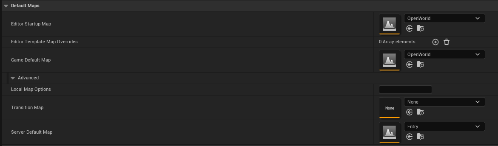

# Traveling in Multiplayer

## Non-/Seamless Travel​

The difference between Seamless and Non-seamless travel is simple.

Seamless travel is a non-blocking operation, while Non-seamless will be a blocking call.

A Non-seamless travel for a client means that they disconnect from the server and then re-connect to the same server, which will have the new map ready to load.

Epic recommends using Seamless travel as often as possible, since this will result in a smoother experience, and will avoid any issues that can occur during the re-connection process.

There are three ways in which a Non-seamless travel must occur:

- When loading a Map for the first time
- When connecting to a Server for the first time as a Client
- When you want to end a Multiplayer Match, and start a new one

## Main Traveling Functions​

Three main functions drive traveling:

### UEngine::Browser​

- Is like a hard reset when loading a new Map

- Will always result in a 'Non-seamless' travel

- Will result in the Server disconnecting current Clients before traveling to the destination Map

- Clients will disconnect from the current Server

- Dedicated Server cannot travel to other Servers, so the Map must be local (cannot be URL)

### UWorld::ServerTravel​

- For the Server only

- Will jump the Server to a new World/Level

- All connected Clients will follow

- This is the way Multiplayer Games travel from Map to Map, and the Server is the one in charge to call this function

- The Server will call 'APlayerController::ClientTravel' for all Client Players that are connected

### APlayerController::ClientTravel​

- If called by a Client, will travel to a new Server

- If called by a Server, will instruct the particular Client to travel to the new Map (But stay connected to the current Server)

## Enabling Seamless Travel​

Seamless travel comes with a Transition Map. This is configured through the 'UGameMapsSettings::TransitionMap' property.
By default this property is empty. If your game leaves this property empty, an empty Map will be created for it.

The reason the Transition Map exists is that there must always be a World loaded (which holds the Map), so we can't free the old map before loading the new one.
Since Maps can be very large it would be a bad idea to have the old and new Map in memory at the same time, so this is where the Transition Map comes in.

Once you have the transition map setup, you set 'AGameMode::bUseSeamlessTravel' to true, and from there, Seamless Travel should work!

This can also be set up via a GameMode Blueprint and the Project Settings in the "Maps and Nodes" Tab.

## Persisting Actors / Seamless Travel​

When using Seamless travel it's possible to carry over (persist) Actors from the current level to the new one. This is useful for certain Actors, like inventory items, players, etc.

By default, these Actors will persist automatically:

- The GameMode Actor (Server only)
  - Any Actors further added via 'AGameMode::GetSeamlessTravelActorList'

- All Controllers that have a valid PlayerState (Server only)

- All PlayerControllers (Server only)

- All local PlayerControllers (Server and Client)
  - Any Actors further added via 'APlayerController::GetSeamlessTravelActorList' called on local PlayerControllers

Here is the general flow when executing 'Seamless' travel:

1. Mark Actors that will persist to the Transition Level (read above)

2. Travel to the Transition Level

3. Mark Actors that will persist to the Final Level (read above)

4. Travel to the Final Level
