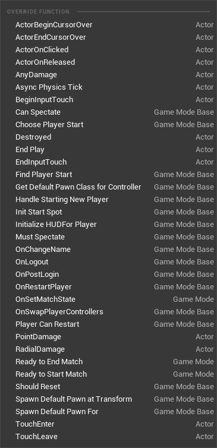
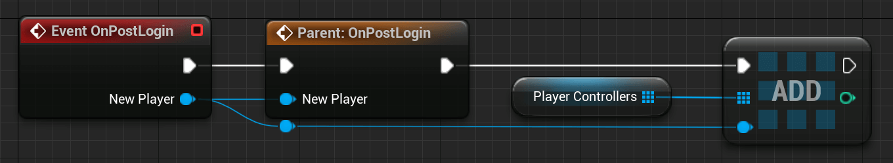
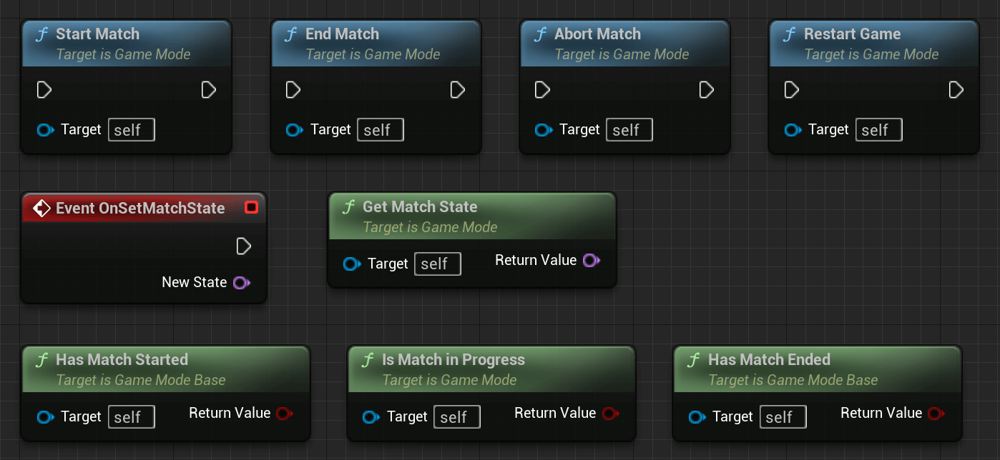
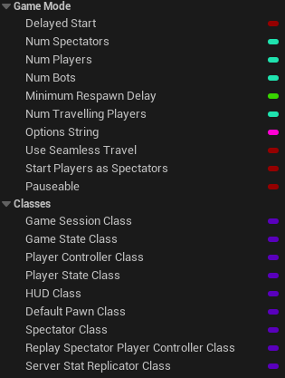
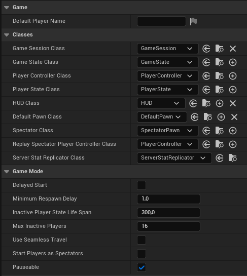
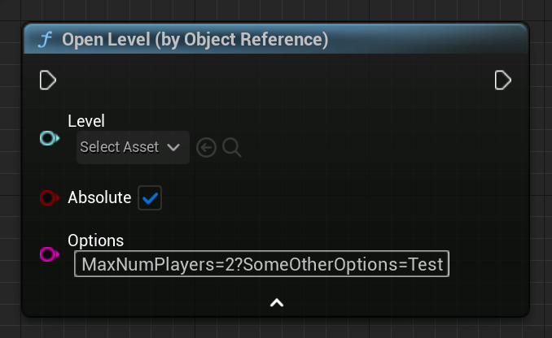
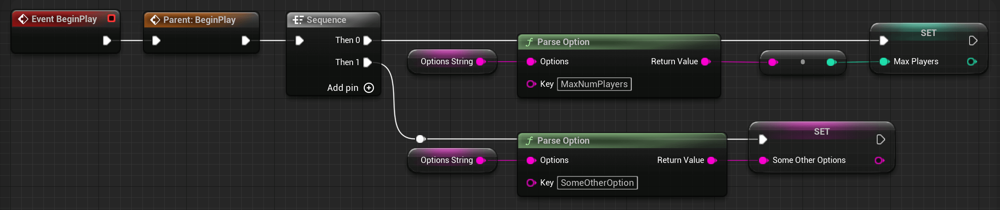

# 游戏模式

> 信息
>
> 在 4.14 中，AGameMode 类分为 AGameModeBase 和 AGameMode。GameModeBase 的功能较少，因为某些游戏可能不需要旧 AGameMode 类的完整功能列表。

AGameMode 类用于定义游戏规则。这包括要生成的其他游戏框架类，例如 APawn、APlayerController、APlayerState 等。

它仅在服务器上可用。客户端没有 AGameMode 类的实例，并且在尝试检索它时只会得到 nullptr。

## 示例和用法

游戏模式的一些用例可能来自较早的第一人称射击游戏，例如《虚幻竞技场》：

死亡竞赛、团队死亡竞赛或夺旗。

这意味着 GameMode 可以定义如下内容：

- 我们有团队还是每个人都与每个人比赛？
- 获胜条件是什么？
  - 某人或一支队伍需要击杀多少人才能得分？
- 积分是如何获得的？
  - 杀人？
  - 偷旗帜？
- 将使用哪些角色？
- 允许携带哪些武器？
  - 只有手枪吗？
  - 只有一本杂志？

对于多人游戏场景，GameMode 还具有一些有趣的功能，可以帮助我们管理玩家和/或比赛的总体流程。

## 蓝图示例​

功能​

我们要采取的第一站是蓝图版本的覆盖函数部分：



您可以实现这些函数的逻辑，以适应您的游戏的特定规则。
这包括更改 GameMode 生成 DefaultPawn 的方式或您想要如何决定游戏是否已准备好开始。

一个例子可能是检查所有玩家是否已加入服务器并准备好：


但也有一些事件可以用来对整个比赛中发生的某些事情做出反应。

我经常使用的一个很好的例子是"Event OnPostLogin"。

每次新玩家加入游戏时都会调用此方法。稍后您将了解有关连接过程的更多信息，但现在我们将继续进行。

该事件会向您传递一个有效的 PlayerController，该控制器由连接玩家的 UConnection 拥有（稍后也会详细介绍）。



这可以用于与该玩家进行交互，例如，为他们生成一个新的 Pawn，或者只是将其 PlayerController 保存在数组中以供以后使用。

正如已经提到的，您可以使用 GameMode 来管理游戏的一般比赛流程。为此，您可以找到一些功能，其中一些功能是可覆盖的，例如"准备开始比赛"。

这些函数和事件可用于控制当前的 MatchState。当"Ready To Start Match"函数返回 TRUE 时，它们中的大多数将被自动调用，但您也可以手动使用它们。



"New State"是一个简单的"FName"类型。您现在可能会问，"为什么这不在 AGameState 类中处理？"

嗯，确实如此。这些 GameMode 函数与 GameState 协同工作。

这只是为了给您一个点来管理任何客户端都无法访问的 MatchState，因为 GameMode 只存在于服务器上！

变量​
GameMode 还具有您可以并且想要使用的重要变量。

这是已经继承的变量的列表。其中一些可以通过 GameMode 蓝图的 ClassDefaults 进行设置：





其中大多数都非常不言自明，例如"默认玩家名称"，它使您能够为每个连接的玩家提供一个可以通过 APlayerState 类访问的默认玩家名称。

或者"bDelayedStart"，这将使游戏无法开始，即使"准备开始比赛"的默认实现满足所有其他条件。

更重要的变量之一是所谓的"选项字符串"。这些是选项，用"?"分隔，您可以通过"OpenLevel"函数或当您将"ServerTravel"作为控制台命令调用时传递这些选项。

您可以使用"解析选项"来提取传递的选项，例如"MaxNumPlayers"：





## UE++ 示例

所有蓝图内容也可以用 C++ 完成。在不再次编写相同信息的情况下，我将提供一些有关如何重新创建之前的蓝图​​示例的代码示例。

由于"ReadyToStartMatch"是"BlueprintNativeEvent"，因此该函数的实际 C++ 实现称为"ReadyToStartMatch_Implementation"。这是我们想要覆盖的：

### 类声明中 AGameMode 子类的头文件

``` cpp
// 本场比赛期间需要/允许的最大玩家数量
int32 MaxNumPlayers;

// 重写 ReadyToStartMatch 的实现
virtual bool ReadyToStartMatch_Implementation() override;
```

### GameMode 子类的 CPP 文件

``` cpp
bool ATestGameMode::ReadyToStartMatch_Implementation()
{
    Super::ReadyToStartMatch();

    return MaxNumPlayers == NumPlayers;
}
```

"OnPostLogin"函数是虚拟函数，在 C++ 中简称为"PostLogin"。

让我们也覆盖它：

``` cpp
// 类声明中 AGameMode 子类的头文件
-------------------------------------------------- ------------------------------------------
// PlayerController 列表
UPROPERTY()
TArray<APlayerController*> PlayerControllerList;

// 重写 PostLogin 函数
virtual void PostLogin(APlayerController* NewPlayer) override;
```

``` cpp
// GameMode 子类的 CPP 文件
-------------------------------------------------- ------------------------------------------
void ATestGameMode::PostLogin(APlayerController* NewPlayer)
{
    Super::PostLogin(NewPlayer);

    PlayerControllerList.Add(NewPlayer);
}
```
