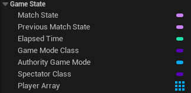
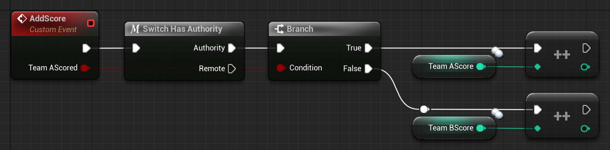

# 游戏状态

> 信息
>
> 在 4.14 中，GameState 类分为 AGameStateBase 和 AGameState。GameStateBase 的功能较少，因为某些游戏可能不需要旧 GameState 类的完整功能列表。

AGameState 类可能是服务器和客户端之间共享信息的最重要的类。

GameState 用于跟踪游戏/比赛的当前状态。对于多人游戏来说，这包括已连接玩家的列表 (APlayerState)。

此外，它会复制给所有客户端，因此每个人都可以访问它。就信息而言，这使得 GameState 成为多人游戏最核心的类之一。

虽然 GameMode 会告诉您需要多少杀戮才能获胜，但 GameState 将跟踪每个玩家和/或团队当前的杀戮数量！

您在这里存储什么信息完全取决于您。它可以是分数数组或自定义结构数组，用于跟踪组和公会。

## 示例和用法

在多人游戏中，AGameState 类用于跟踪游戏的当前状态，其中还包括玩家及其 PlayerState。

GameMode 确保调用 GameState 的 MatchState 函数，并且 GameState 本身也允许您在客户端上使用它们。

与 GameMode 相比，GameState 并没有给我们太多的帮助，但这仍然允许我们创建我们的逻辑，该逻辑主要应该尝试将信息传播给客户端。

### 蓝图示例

#### 变量



我们从 AGameState 基类中获取一些可以利用的变量。PlayerArray、MatchState 和 ElapsedTime 都会被复制，因此客户端也可以访问它们。

这不计入 AuthorityGameMode。只有服务器可以访问它，因为 GameMode 仅存在于服务器上。

PlayerArray 不会直接复制，但是，每个 PlayerState 都会被复制，并且它们会在构造时将自己添加到 PlayerArray 中。此外，它们由 GameState 收集，只是为了确保竞争条件不会导致问题。

快速插入显示如何将 PlayerStates 收集到 C++ 中的 PlayerArray 中。

``` cpp
// PlayerState 类本身的内部
-------------------------------------------------- ------------------------------------------
void APlayerState::PostInitializeComponents()
{
    // […]

    UWorld* World = GetWorld();
    // Register this PlayerState with the Game's ReplicationInfo
    if (World->GameState != NULL) {
        World->GameState->AddPlayerState(this);
    }

    // […]
}
```

``` cpp
// 在 GameState 中
-------------------------------------------------- ------------------------------------------
void AGameState::PostInitializeComponents()
{
    // […]

    for (TActorIterator<APlayerState> It(World); It; ++It) {
        AddPlayerState(*It);
    }
}

void AGameState::AddPlayerState(APlayerState* PlayerState)
{
    if (!PlayerState->bIsInactive) {
        PlayerArray.AddUnique(PlayerState);
    }
}
```

所有这一切都发生在服务器以及 Player 和 GameState 的客户端实例上！

#### Functions​

我可以为您提供的一个小功能示例是跟踪"A"和"B"两支球队的得分。假设我们有一个 CustomEvent，当球队得分时会调用该事件。

它传递一个布尔值，这样我们就知道哪支球队得分了。我们还可以传递 PlayerState、Team 或任何您用来识别得分者的信息。

稍后在"复制"章节中，您将了解只有服务器可以（并且应该）复制变量的规则，因此我们确保只有他可以调用此事件。

该事件是从另一个类调用的（例如杀死某人的武器），并且这应该发生在服务器上（总是！），因此我们在这里不需要 RPC。



由于这些变量和 GameState 是复制的，因此您可以使用这两个变量并将它们放入您需要的任何其他类中。例如，将它们显示在记分板小部件中。

#### UE++ Examples​

为了重新创建这个小示例，我们需要更多的代码，但是尽管函数本身，每个类只需要一次设置复制所需的代码。

``` cpp
// Header file of our AGameState class inside of the class declaration
--------------------------------------------------------------------------------
// You need this included to get the replication working.
#include "UnrealNetwork.h"

// Replicated specifier used to mark this variable to replicate
UPROPERTY(Replicated)
int32 TeamAScore;

UPROPERTY(Replicated)
int32 TeamBScore;

// Function to increase the score of a team
void AddScore(bool bTeamAScored);
```

您将在复制部分阅读有关此功能的更多信息！

``` cpp
// CPP file of our AGameState child class
--------------------------------------------------------------------------------
// This function is required through the replicated specifier in the UPROPERTY macro and is declared by it
void ATestGameState::GetLifetimeReplicatedProps(TArray& OutLifetimeProps) const
{
    Super::GetLifetimeReplicatedProps(OutLifetimeProps);

    DOREPLIFETIME(ATestGameState, TeamAScore);
    DOREPLIFETIME(ATestGameState, TeamBScore);
}
```

``` cpp
// CPP file of our AGameState child class
--------------------------------------------------------------------------------
void ATestGameState::AddScore(bool bTeamAScored)
{
    if (bTeamAScored) {
        TeamAScore++;
    } else {
        TeamBScore++;
    }
}
```
