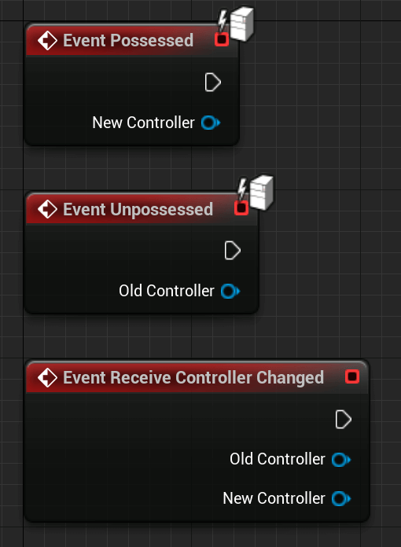
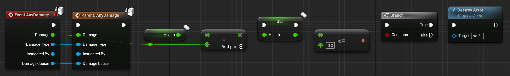
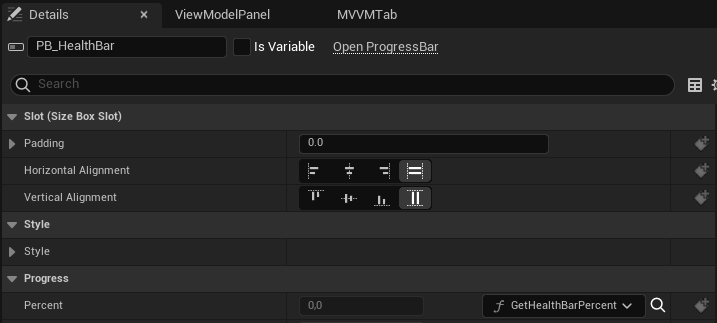
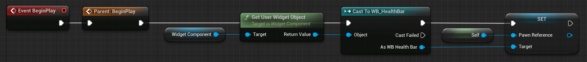
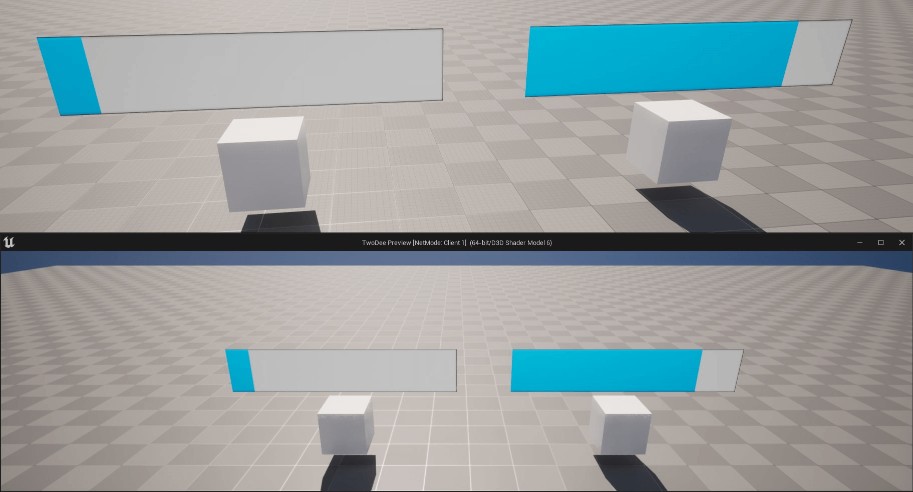

# APawn 和 ACharacter

APawn 类是玩家控制的"AActor"。大多数时候它是一个人形角色，但也可能是一只猫、飞机、船、方块等。
玩家一次只能拥有一个 Pawn，但可以通过取消拥有和重新拥有它们来轻松切换 Pawn。

Pawn 大部分被复制到所有客户端。

Pawn 的子类 ACharacter 经常被使用，因为它带有一个已经联网的 MovementComponent，用于处理复制玩家角色的位置、旋转等。

## 示例和用法

在多人游戏中，我们主要使用 Pawn 的复制部分来显示角色并与其他人共享一些信息。一个简单的例子是角色的"健康"。
但我们不仅复制"健康"以使其对其他人可见，我们还复制它以便服务器对其拥有权限并且客户端无法作弊。

### 蓝图​

尽管有标准的可重写函数，Pawn 也有两个可以让您对它被玩家或 AIController 取消/占有做出反应。



> 信息
>
> 由于拥有逻辑发生在服务器上，这些事件仅在 Pawn/Character 的服务器版本上调用。
>
> 还有一个名为 ReceiveControllerChanged 的​​函数，它允许您对相同的事件做出反应，但在客户端。

下图将展示如何使用 EventAnyDamage 函数和复制的 Health 变量来降低玩家的生命值。

这发生在服务器上而不是客户端上！



由于 Pawn 应该被复制，只要服务器调用 DestroyActor 节点，它也会销毁 Pawn 的客户端版本。
在客户端站点上，我们可以将复制的"健康"变量用于 HUD 或每个人头顶上的健康栏。

您可以通过创建带有 ProgressBar 和对 Pawn 的引用的 UserWidget 来轻松完成此操作。

由于这是一个多人游戏纲要，我希望您了解 UserWidgets，或者至少在其他地方阅读有关它们的信息。

假设我们的"BP_Character"类上有一个"Health"和"MaxHealth"变量，全部设置为复制（如果 MaxHealth 运行时永远不会改变，您可以跳过复制）。

现在，在 UserWidget 和 ProgressBar 内部创建"BP_Character"引用变量后，我们可以将该条的百分比绑定到以下函数：




此外，在设置 WidgetComponent 后，我​​们可以将"要使用的小部件类"设置为您的 HealthBar UserWidget，并在 BeginPlay 上执行以下操作：



"BeginPlay"在 Pawn 的所有实例上调用，这意味着在服务器和所有客户端上。

所以现在每个实例都将自己设置为它所拥有的 UserWidget 的 Pawn 引用。

由于 Pawn 和生命值变量被复制，我们在每个 Pawn 的头部上方都有正确的百分比。



如果此时复制过程还不清楚，请不要担心，只要继续阅读，在读完本文后，您就会明白为什么它如此简单！

### UE++​

对于 C++ 示例，我不会重新创建 UserWidget 示例。要让 UserWidgets 在 C++ 中工作需要做太多的样板文件，我不想在这里讨论这个。

所以我们将重点关注占有和伤害事件。在C++中，两个Possess事件被称为：

``` cpp
virtual void PossessedBy(AController* NewController);

virtual void UnPossessed();
```

不过，"UnPossessed"事件不会传递旧的 PlayerController。

我们还想用 C++ 重新创建 Health 示例。与往常一样，如果您现在不明白复制的步骤，请不要担心，接下来的章节将为您解释。

如果示例在复制方面看起来太复杂，请暂时跳过这些示例。

"TakeDamage"函数相当于"EventAnyDamage"节点。为了造成伤害，您通常会对要对其造成伤害的 Actor 调用"TakeDamage"，如果该 Actor 实现了该函数，它将对此做出反应，类似于本示例的做法。

``` cpp
// 我们的 APawn 子类的头文件，位于类声明中
-------------------------------------------------- ------------------------------------------
// 复制 Health 变量
UPROPERTY(Replicated)
int32 Health;

// Overriding the TakeDamage event
virtual float TakeDamage(float Damage, struct FDamageEvent const& DamageEvent, AController* EventInstigator, AActor* DamageCauser) override;
```

``` cpp
// CPP
-------------------------------------------------- ------------------------------------------
// 此函数是必需的，并且 UPROPERTY 宏中的复制说明符导致为我们声明它。我们只需要实现它
void ATestPawn::GetLifetimeReplicatedProps(TArray<FLifetimeProperty>& OutLifetimeProps) const
{
    Super::GetLifetimeReplicatedProps(OutLifetimeProps);

    // This tells UE that we want to replicate this variable
    DOREPLIFETIME(ATestPawn, Health);
}

float ATestPawn::TakeDamage(float Damage, struct FDamageEvent const& DamageEvent, AController*EventInstigator, AActor* DamageCauser)
{
    const float ActualDamage = Super::TakeDamage(Damage, DamageEvent, EventInstigator, DamageCauser);

    // Lower the Health of the Player
    Health -= ActualDamage;

    // And destroy it if the Health is less or equal 0
    if (Health <= 0.f)
    {
        Destroy();
    }

    return ActualDamage;
}
```
