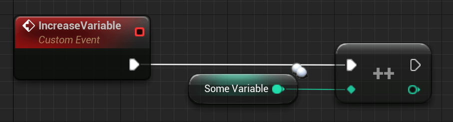
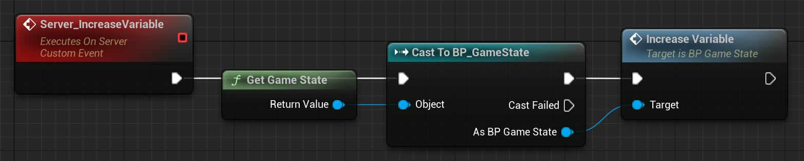
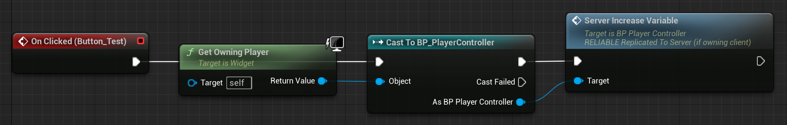

# APlayerController

APlayerController 类可能是我们遇到的最有趣、最复杂的类。它也是许多客户端逻辑的中心，因为这是客户端实际"拥有"的第一个类。

PlayerController 可以被视为玩家的"输入"。它是玩家与服务器的链接。这进一步意味着每个客户端都有一个 PlayerController。
客户端的 PlayerController 仅存在于其端以及服务器上。客户端无法访问其他客户端的 PlayerController。

每个客户端只知道自己的 PlayerController！

结果是服务器拥有所有客户端 PlayerController 的引用！

术语"输入"并不直接意味着所有实际输入（按钮按下、鼠标移动、控制器轴等）都需要放置在 PlayerController 中。

将 Pawn/角色特定的输入（汽车与人类的工作方式不同）放入您的 APawn/ACharacter 类中，并将适用于所有角色的输入（甚至当角色对象无效时）放入您的 PlayerController 中是一个很好的做法。

此外，需要了解的重要一点是：

如何获得正确的 PlayerController？

著名的节点"GetPlayerController(0)"或代码行"UGameplayStatics::GetPlayerController(GetWorld(), 0);" 在服务器和客户端上的工作方式不同。

- 在Listen-Server上调用它会返回Listen-Server的PlayerController
- 在客户端上调用它会返回客户端的PlayerController
- 在专用服务器上调用它将返回第一个客户端的 PlayerController

"0"以外的其他数字将不会返回客户端的其他客户端的 PlayerController。该索引适用于本地玩家（分屏），我们在此不做介绍。

## 示例和用法​

尽管 APlayerController 是网络中最重要的类之一，但默认情况下它并没有太多功能。

因此，我们将创建一个小示例来阐明为什么需要它。在有关所有权的章节中，您将了解为什么 PlayerController 对于 RPC 很重要。

以下示例将向您展示如何通过按下 UserWidget 按钮，利用 PlayerController 来增加 GameState 中的复制变量。

为什么我们需要 PlayerController？

好吧，我不想把 RPC 和所有权章节写两遍，所以只做一个简短的解释：

UserWidgets 仅存在于本地播放器（作为客户端或 ListenServer）上，即使它们由客户端拥有，ServerRPC 在服务器上也没有可以运行的实例。

简直无法复制！

这意味着我们需要一种方法将按钮 Press 传递到服务器，以便它可以增加变量。

为什么不直接在 GameState 上调用 RPC？

因为它是服务器拥有的。ServerRPC 需要客户端作为所有者！

### 蓝图​

首先，我们需要一个简单的 UserWidget 和一个可以按下的按钮。

我将以相反的顺序发布图像，以便您可以看到它的结束位置以及哪些事件称为前一个图像的事件。

所以从我们的目标 GameState 开始。它获得一个正常事件，该事件增加复制的整数变量：



该事件将在服务器端、我们的 PlayerController 中的 ServerRPC 内被调用：



最后，我们有了按钮，按下该按钮并调用 ServerRPC：



因此，当我们单击按钮（客户端）时，我们使用 PlayerController 中的 ServerRPC 到达服务器端（可能，因为 PlayerController 归客户端所有！），然后调用 GameState 的"IncreaseVariable"事件来增加复制的整数变量。

由于该整数变量是由服务器复制和设置的，因此现在将在 GameState 的所有实例上更新，以便客户端也可以看到更新！

### UE++​

对于此示例的 C++ 版本，我将用 PlayerController 的 BeginPlay 替换 UserWidget。然而，这没有多大意义，在 C++ 中实现 UserWidgets 需要更多代码，我不想在这里发布这些代码。

``` cpp
// 我们的 APlayerController 子类的头文件，位于类声明中
-------------------------------------------------- ------------------------------------------
// 服务器 RPC。您将在 RPC 章节中阅读更多相关内容
UFUNCTION(Server, unreliable, WithValidation)
void Server_IncreaseVariable();

// 还重写本示例的 BeginPlay 函数
virtual void BeginPlay() override;
```

``` cpp
// AGameState 子类的头文件，位于类声明中
-------------------------------------------------- ------------------------------------------
// 复制整型变量
UPROPERTY(Replicated)
int32 OurVariable;

public:
// Function to increment the variable
void IncreaseVariable();
```

``` cpp
// 我们的 PlayerController 子类的 CPP 文件
-------------------------------------------------- ------------------------------------------
// 否则我们无法访问 GameState 函数
#include "TestGameState.h"

// 稍后您将了解 RPC 以及为什么"_Validate"是一个东西
bool ATestPlayerController::Server_IncreaseVariable_Validate() {
    return true;
}

// 稍后您将了解 RPC 以及为什么"_Implementation"如此重要
void ATestPlayerController::Server_IncreaseVariable_Implementation() {
    ATestGameState* GameState = Cast<ATestGameState>(UGameplayStatics::GetGameState(GetWorld()));
    GameState->IncreaseVariable();
}

void ATestPlayerController::BeginPlay() {
    Super::BeginPlay();

    // BeginPlay 在 Actor 的每个实例上被调用，在该 PlayerController 的服务器版本上也是如此。
    // 我们要确保只有本地玩家调用此 RPC。再说一遍，这个例子不一定有多大意义
    // 因为我们可以翻转条件并且根本不需要 RPC，但是 C++ Widget，你知道......
    // 我们还可以在这里使用"IsLocalPlayerController()"
    if (Role < ROLE_Authority) {
        Server_IncreaseVariable();
    }
}
```

``` cpp
// AGameState 子类的 CPP 文件
--------------------------------------------------------------------------------
// 此函数是必需的，并且 UPROPERTY 宏中的复制说明符导致为我们声明它。我们只需要实现它
void ATestGameState::GetLifetimeReplicatedProps(TArray<FLifetimeProperty>& OutLifetimeProps) const {
    Super::GetLifetimeReplicatedProps(OutLifetimeProps);

    // This tells UE that we want to replicate this variable
    DOREPLIFETIME(ATestGameState, OurVariable);
}

void ATestGameState::IncreaseVariable() {
    OurVariable++;
}
```

这是相当多的代码。如果您还不了解某些函数的使用及其命名，请不要担心。接下来的部分将帮助您理解为什么这样做。
