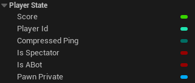
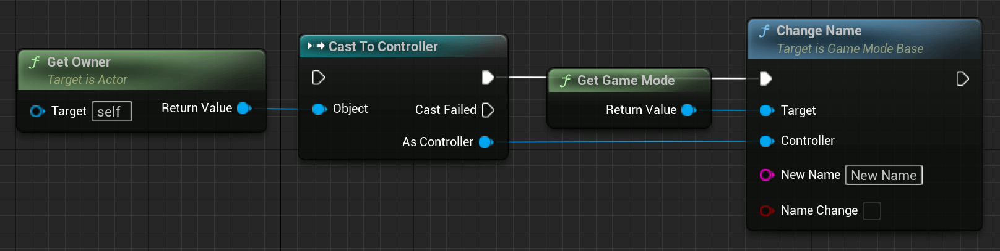

# APlayerState

APlayerState 类是共享特定玩家信息的最重要的类。它旨在保存有关玩家的当前信息。每个玩家都有自己的 PlayerState。

PlayerState 也会复制给每个人，并可用于在其他客户端上检索和显示数据。访问所有 PlayerState 的一个简单方法是 AGameState 类中的 PlayerArray。

您可能想要存储在 PlayerState 中的示例信息：

- PlayerName - 玩家的当前姓名
- 得分 - 玩家当前得分
- Ping - 玩家当前的 ping
- TeamID - 玩家所在球队的ID
- 或其他玩家可能需要了解的其他复制信息

## 示例和用法

我能提供的大多数例子都非常具体。因此，我们将看看一些已经可用的属性，以及一些更有趣的函数。

### 蓝图示例

蓝图暴露了一些变量，它们或多或少有用。遗憾的是，其中一些并未公开其所有功能，因此最好用您自己的功能替换它们。



这些变量都会被复制，因此它们在所有客户端上保持同步。

遗憾的是，它们在蓝图中不容易设置，但没有什么可以阻止您创建它们的版本。

如何设置 PlayerName 变量的一个示例是通过调用 GameMode 函数"ChangeName"并将其传递给玩家的 PlayerController。



PlayerState 还用于确保数据在无缝级别更改或意外连接问题期间保持持久性。

PlayerState 有两个函数专门用于处理重新连接的玩家以及与服务器无缝移动到新地图的玩家。

虽然最初不是这样，但现在这些功能也可用于蓝图。

PlayerState 负责将其已保存的信息复制到新的 PlayerState 中。这要么是通过级别变化创建的，要么是因为玩家重新连接而创建的。


### UE++ 示例​

让我们看一下 C++ 中的相同函数。

``` cpp
// 我们的 APlayerState 子类的头文件位于类声明中
-------------------------------------------------- ------------------------------------------
// 用于将属性从当前 PlayerState 复制到传递的 PlayerState
virtual void CopyProperties(class APlayerState* PlayerState);

// 用于使用传递的 PlayerState 的属性覆盖当前 PlayerState
virtual void OverrideWith(class APlayerState* PlayerState);
```

这些函数可以在您自己的 C++ PlayerState 子类中实现，以管理您添加到自定义 PlayerState 的数据。

确保在末尾添加"override"说明符，并调用"Super::"，以便原始实现保持活动状态。

您的实现可能与此类似：

``` cpp
// 我们的 APlayerState 子类的 CPP 文件
-------------------------------------------------- ------------------------------------------
void ATestPlayerState::CopyProperties(class APlayerState* PlayerState)
{
    Super::CopyProperties(PlayerState);

    if (IsValid(PlayerState)) {
        ATestPlayerState* TestPlayerState = Cast<ATestPlayerState>(PlayerState);
        if (IsValid(TestPlayerState)) {
            TestPlayerState->SomeVariable = SomeVariable;
        }
    }
}

void ATestPlayerState::OverrideWith(class APlayerState* PlayerState)
{
    Super::OverrideWith(PlayerState);

    if (IsValid(PlayerState)) {
        ATestPlayerState* TestPlayerState = Cast<ATestPlayerState>(PlayerState);
        if (IsValid(TestPlayerState)) {
            SomeVariable = TestPlayerState->SomeVariable;
        }
    }
}
```
