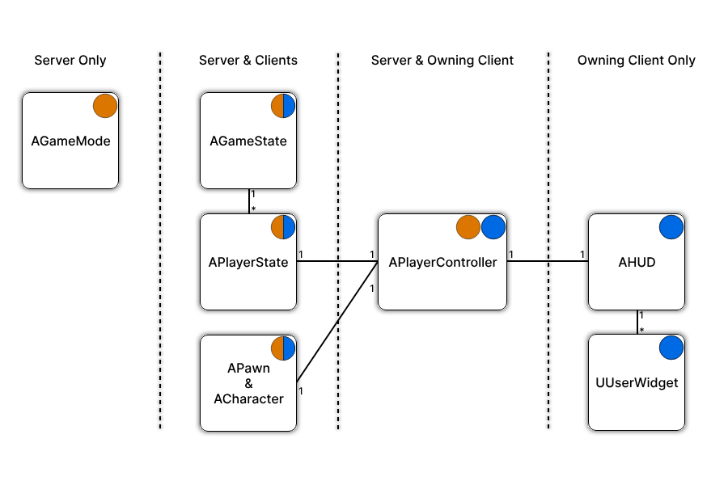
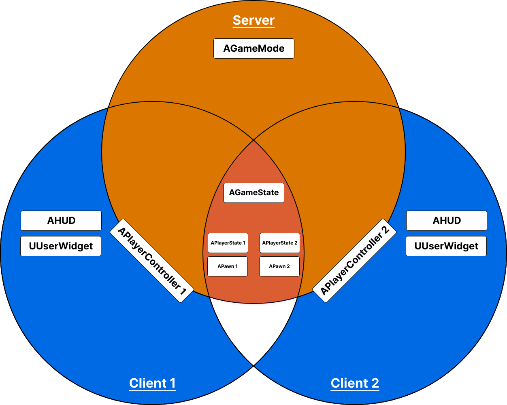

# 游戏框架+网络

根据前面关于虚幻引擎的服务器-客户端架构和常用类的信息，我们可以将它们分为四类：

- 仅服务器 - 这些对象仅存在于服务器上
- 服务器和客户端 - 这些对象存在于服务器和所有客户端上
- 服务器和拥有的客户端 - 这些对象仅存在于服务器和拥有的客户端上
- 仅拥有的客户端 - 这些对象仅存在于拥有客户端上

"拥有的客户端"是拥有相关 Actor 的玩家/客户端。就像您拥有自己的计算机一样。在后面的章节中，所有权对于"RPC"来说变得很重要。

下面两张图向您展示了一些常见的类以及它们存在于哪个类别中。

第二张图演示了具有两个连接的客户端的专用服务器的示例。

