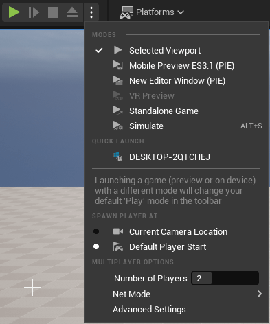
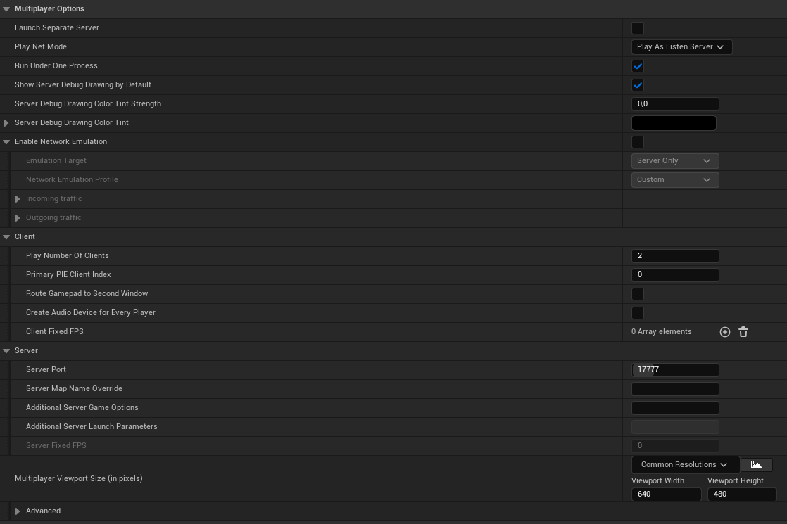
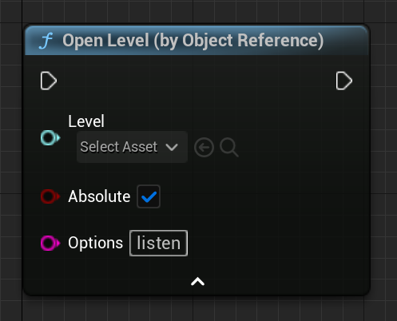
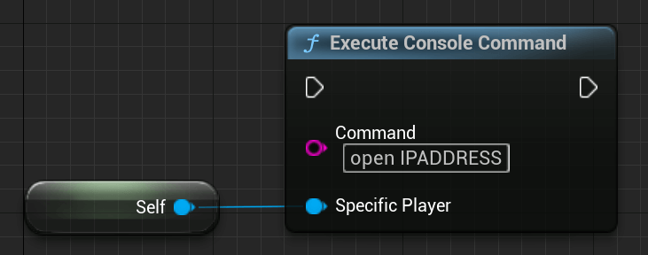

# 如何开始多人游戏

开始多人游戏的最简单方法是在"游戏"下拉菜单中将"玩家数量"设置为大于 1 的值。



这将自动在服务器和客户端之间创建网络连接。因此，即使您在主菜单级别开始游戏并将"玩家数量"设置为 2+，游戏也会连接！

这始终是网络连接。这不是本地沙发多人游戏连接。这需要以不同的方式处理，此时不会涉及。

## 高级设置​



### 在一个进程下运行​

当选中"使用单进程"时，会在虚幻引擎的单个实例中生成多个窗口。

未选中此选项时，将为分配的每个玩家启动多个 UE 实例。

如果不选中"运行专用服务器"，第一个播放器将是监听服务器。

另一方面，当将其标记为 TRUE 时，所有玩家都将是客户端。

### 启动并连接到服务器​

检查"会话管理"选项卡以了解如何通过会话系统设置会话/服务器。让我们看看如何在没有会话的情况下启动和加入服务器。

#### 蓝图​

##### 启动（监听）服务器​



要在没有会话系统的情况下启动服务器，您只需使用"OpenLevel"节点并向其传递"级别名称"和"监听"选项即可。
您还可以传递更多选项，以"？"分隔，可以在 AGameMode 类中检索这些选项，如下所述。

没有会话系统的专用服务器已经在正确的地图上启动，您可以在项目设置的"地图和模式"部分中指定。

##### 连接到服务器​



要连接到服务器，您只需使用"执行控制台命令"节点和命令"open IPADDRESS"，其中"IPADDRESS"被服务器的实际IP地址替换。

例如，这可以通过小部件文本框填写。

#### UE++​

与蓝图类似，您可以使用这两个函数，它们与蓝图节点具有相同的结果。

##### 启动（监听）服务器​

``` cpp
UGameplayStatics::OpenLevel(GetWorld(), "关卡名称", true, "听");
```

##### 连接到服务器​

``` cpp
// 假设您尚未在 PlayerController 中（如果是，则直接调用 ClientTravel）
APlayerController* PlayerController = UGameplayStatics::GetPlayerController(GetWorld(), 0);
PlayerController->ClientTravel("IPADDRESS", ETravelType::TRAVEL_Absolute);
```

### 通过命令行启动

基本命令行（这些命令使用编辑器，因此不需要熟数据）：

| 类型 | 命令 |
| ---- | -------- |
| 监听服务器 | UE4Editor.exe 项目名称 地图名称？听 - 游戏 |
| 专用服务器 | UE4Editor.exe 项目名称 地图名称 -server -game -log | UE4Editor.exe
| 客户| UE4Editor.exe 项目名称 ServerIP -游戏 | UE4Editor.exe

> 信息
>
> 专用服务器默认是无头的。如果您不使用"-log"，您将不会看到任何显示专用服务器的窗口！

### 连接过程

当新客户端第一次连接时，会发生一些事情：

首先，客户端会向服务器发送连接请求。

服务器将处理此请求，如果服务器不拒绝连接，则会将响应发送回客户端，并提供继续操作的正确信息。

下页将显示连接过程的主要步骤。这是官方文档的直接摘录。

主要步骤是​

1. 客户端发送连接请求。

2. 如果服务器接受，则会发送当前地图

3. 服务器将等待客户端加载该地图

4. 加载后，服务器将在本地调用"AgameMode::PreLogin"
    - 这将使 GameMode 有机会拒绝连接

5. 如果接受，服务器将调用"AgameMode::Login"

    - 该函数的作用是创建一个PlayerController，然后将其复制到新连接的Client。

        收到后，此 PlayerController 将替换在连接过程中用作占位符的客户端临时 PlayerController 请注意，此处将调用"APlayerController::BeginPlay"。

        应该注意的是，在此 actor 上调用 RPC 函数尚不安全。您应该等到"AGameMode::PostLogin"被调用。

6. 假设一切顺利，将调用"AGameMode::PostLogin"。
    - 此时，服务器可以安全地开始调用此 PlayerController 上的 RPC 函数。
