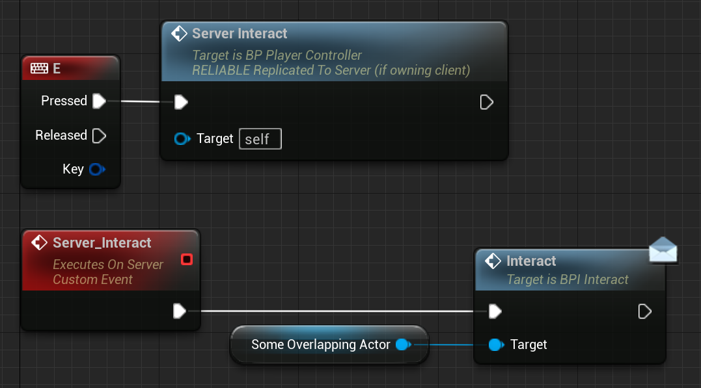

# 所有权

所有权是需要理解的非常重要的事情。您已经看到一个表格，其中包含"客户拥有的 Actor "等条目。

服务器或客户端可以"拥有"一个 Actor。

一个例子是本地玩家（客户端或监听服务器）拥有的 PlayerController。

另一个例子是场景中生成/放置的门。这主要由服务器拥有。

但为什么这是一个问题呢？

如果您再次查看之前的表格，您会注意到，例如，如果客户端在不属于自己的 Actor 上调用服务器 RPC，则服务器 RPC 将被删除。

因此，客户端无法在服务器拥有的门上调用"Server_Interact"。但我们如何解决这个问题呢？

我们使用客户端拥有的类/Actor，这就是 PlayerController 开始发挥作用的地方。在讨论 PlayerController 类时，我们已经有一个类似的示例，其中我们发送 RPC 以根据 UserWidget 按钮按下来增加值。

因此，我们不是尝试在门上启用输入并在那里调用 ServerRPC，而是在 PlayerController 中创建 ServerRPC 并让服务器调用门上的接口函数（例如"Interact"）。

> 信息
>
> 界面并不是多人游戏特有的，如果您还不了解它们，我强烈建议您查找它们。

## Actor 及其所属关系​

正如游戏框架概述中已经提到的，PlayerController 是玩家"拥有"的第一个类，但这是什么意思呢？

每个"连接"都有一个专门为该连接创建的 PlayerController。为此原因创建的 PlayerController 归该 Connection 所有。

因此，当我们想要确定某个 Actor 是否由某人拥有时，我们会向上（递归）查询，直到到达最外层的所有者，如果这是一个 PlayerController，那么拥有该 PlayerController 的 Connection 也拥有该 Actor。

有点简单，或者？那么什么是这样的例子呢？

典当/角色。它们被 PlayerController 占有，在此期间，PlayerController 是被占有的 Pawn 的所有者。这意味着拥有此 PlayerController 的 Connection 也拥有 Pawn。

只有当 PlayerController 拥有 Pawn 时才会出现这种情况。取消拥有它将导致客户不再拥有该 Pawn。

那么为什么这很重要以及我需要它做什么？

- RPC 需要确定哪个客户端将执行 Run-On-Client RPC
- 参与者复制和连接相关性
- 涉及所有者时的 Actor 属性复制条件

您已经了解到，RPC 在被客户端或服务器调用时会有不同的反应，具体取决于它们所拥有的连接。

您还了解了条件复制，其中变量仅在特定条件下复制。

以下部分描述了列表的相关部分。
