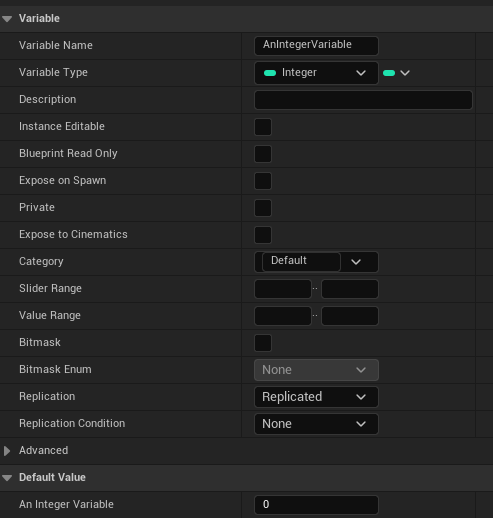
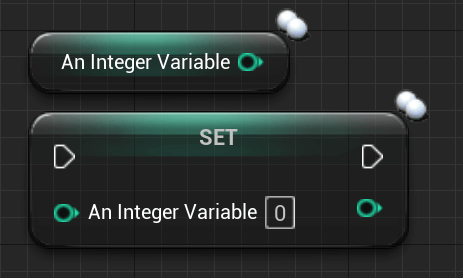

# 复制

## 什么是"复制"？​

复制是服务器将信息/数据传递给客户端的行为。

这可以仅限于特定实体和团体。蓝图主要根据受影响的 AActor 的设置执行复制。

第一个能够复制属性的类是 AActor 类。虽然您也可以复制 UObject，但它们是通过 AActor 复制的，仍然需要您有某种 AActor 来处理复制。

UActorComponent 是 UObject 的一个很好的例子，它支持通过 AActor 进行复制，而无需我们做太多额外的工作。

所有前面提到的类都在某个时刻继承自 AActor，使它们能够在需要时复制属性。尽管并非所有人都以相同的方式这样做。

例如，AGameMode 根本不复制，仅存在于服务器上。而且AHUD只存在于客户端，也不复制。

## 如何使用"复制"？


可以在 AActor 子类的类默认值/构造函数中激活复制：

``` cpp
// 字符构造函数的示例
-------------------------------------------------- ------------------------------------------
ATestCharacter::ATestCharacter(const FObjectInitializer& ObjectInitializer) : Super(ObjectInitializer) {
    b重复=真；
    bReplicateMovement = true;
}
```

'bReplicates' 设置为 TRUE 的 Actor 将在所有客户端上生成并复制（如果由服务器生成）。并且仅当由服务器生成时。

如果客户端生成此 Actor，则该 Actor 将仅存在于该客户端上。

## 复制属性​



启用复制后，我们可以复制 Actor 内部的变量。有多种方法可以做到这一点。我们将从最基本的开始：

将"Replication"下拉菜单设置为"Replicated"将确保该变量被复制到该 Actor 的所有复制实例。

变量在一定条件下可以被复制。我们将进一步讨论这些内容。

复制变量用两个白色圆圈标记。



在 C++ 中复制变量需要稍微多做一些工作。

``` cpp
// 类声明中的头文件
-------------------------------------------------- ------------------------------------------
// 创建复制的健康变量
UPROPERTY(Replicated)
float Health;
```

.cpp 文件将获取此"GetLifetimeReplicatedProps"函数。当将变量标记为已复制时，UE 已经为我们创建了该函数的标头声明。

在此函数中，您可以定义复制变量的规则。

``` cpp
void ATestPlayerCharacter::GetLifetimeReplicatedProps(TArray& OutLifetimeProps) const {
    Super::GetLifetimeReplicatedProps(OutLifetimeProps);

    // 这里我们列出了我们想要复制的变量
    DOREPLIFETIME(ATestPlayerCharacter, Health);
}
```

您还可以在此处进行条件复制：

``` cpp
// Replicates the Variable only to the Owner of this Object/Class
DOREPLIFETIME_CONDITION(ATestPlayerCharacter, Health, COND_OwnerOnly);
```

| Condition | Description |
| --------- | ----------- |
|COND_InitialOnly        | This property will only attempt to send on the initial bunch |
|COND_OwnerOnly          | This property will only send to the Actor's owner |
|COND_SkipOwner          | This property send to every connection EXCEPT the owner |
|COND_SimulatedOnly      | This property will only send to simulated Actors |
|COND_AutonomousOnly     | This property will only send to autonomous Actors |
|COND_SimulatedOrPhysics | This property will send to simulated OR bRepPhysics Acto |
|COND_InitialOrOwner     | This property will send on the initial bunch, or to the Actor's owner |
|COND_Custom             | This property has no particular condition, but wants the ability to toggle on/off via SetCustomIsActiveOverride |

重要的是要了解整个复制过程仅适用于从服务器到客户端，而不是相反。

稍后我们将学习如何让服务器复制客户端想要与其他人共享的内容（例如他们的玩家名）。

复制变量的另一种方法是将其标记为"ReplicatedUsing"。在蓝图中，这称为"RepNotify"。它允许指定一个函数，当变量的新值复制到客户端时，该函数将在客户端上调用。


在蓝图中，一旦您在"复制"下拉菜单中选择"RepNotify"，就会自动创建此函数：


C++ 版本需要更多一些，但工作原理相同：

``` cpp
// 类声明内的头文件
--------------------------------------------------------------------------------
// Create RepNotify Health variable
UPROPERTY(ReplicatedUsing=OnRep_Health)
float Health;

// Create OnRep function | UFUNCTION() Macro is important! | Doesn't need to be virtual
UFUNCTION()
virtual void OnRep_Health();
```

``` cpp
// CPP file of the class
--------------------------------------------------------------------------------
void ATestCharacter::OnRep_Health() {
    if (Health <= 0.f) {
        PlayDeathAnimation();
    }
}
```

使用"ReplicatedUsing=FUNCTIONNAME"，我们指定成功复制变量时应调用的函数。该函数需要有"UNFUNCTION()"宏，即使该宏为空！

> 销售代表通知 C++ 和蓝图之间的差异
>
> 这里需要注意的是，C++ 和蓝图处理 RepNotify 的方式略有不同。在 C++ 中，RepNotify 函数仅为客户端调用 > 。
>
> 当服务器改变值并需要调用OnRep函数时，您需要在调整变量后手动调用它。这是因为 OnRep 函数是变量复制到客户端时的回调。
>
> 然而，在蓝图中，OnRep 函数将调用客户端和服务器。这是因为 OnRep 的 BP 版本是"属性更改"回调。这意味着该函数也将调用服务器，而且如果客户端在本地更改变量，也会调用客户端。
